

  
   
   
  

  Olá! Meu nome é <b>Luiz</b> e atualmente curso o <b>6º semestre de Banco de Dados</b> na Fatec de São José dos Campos. Trabalho como Business Analyst I na <b>Your ID INC</b>.
   

  

    
    
    
  

  

<!-- 1º Semestre -->

 <h1>1º Semestre • 1/2024</h1>

  <h3><a href="https://github.com/Steam-Ducks/scientific-calculator/tree/main" target="_blank">Calculadora Científica</a></h3>
  
<i>Aplicação em terminal desenvolvida para executar operações matemáticas, conversões numéricas e validações de entrada, evoluindo de VisualG para TypeScript ao longo das sprints.</i>

   
  
   
  

    
  

  
Detalhes do Projeto

  

    
  

  

    No primeiro semestre de 2024, desenvolvemos o projeto <b>Calculadora Científica</b>, uma aplicação em terminal criada para executar operações matemáticas, conversões entre bases numéricas e outros cálculos complementares. O projeto foi desenvolvido em contexto acadêmico, com foco no aprendizado prático de programação e organização de software, atendendo a um <b>cliente interno</b>.
  

  

    O desenvolvimento foi dividido em sprints, com as primeiras entregas realizadas em <b>VisualG</b> e a evolução posterior para <b>TypeScript</b>. Entre as funcionalidades implementadas estavam operações aritméticas, divisão, fatorial, cálculo de juros, concatenação de strings e conversões entre diferentes bases numéricas. Essa transição foi importante para consolidar a lógica de programação e também para introduzir o time a práticas mais próximas do desenvolvimento real, como modularização, versionamento e integração entre funcionalidades.
  

  

    Atuei como <b>desenvolvedor</b>, contribuindo principalmente com a integração das operações ao menu principal, com a validação de entradas e o tratamento de erros na divisão e com o desenvolvimento das conversões entre bases numéricas. Além da construção funcional da calculadora, o projeto também exigiu cuidado com a experiência de uso no terminal, a organização dos menus e o tratamento de entradas inválidas.
  

  

    
  

  

    
  

   

  

    
🛠️ Implementação e integração de funcionalidades no menu principal

    

    

      Uma das minhas contribuições foi participar da organização do fluxo principal da calculadora, conectando operações ao menu e ajudando a estruturar a navegação do sistema em terminal. Esse tipo de contribuição foi importante para garantir que as funções desenvolvidas pela equipe pudessem ser acessadas de forma clara e organizada pelo usuário.
    

  

      O menu principal centralizava operações como soma, subtração, multiplicação, divisão, fatorial, função de segundo grau, cálculo de juros, conversões e concatenação de strings. Além disso, a aplicação também contava com submenus específicos, como o de conversão de base, o que ajudava a manter a experiência de uso mais intuitiva.
    

  
<b>Trecho do código:</b>

    
    <pre><code class="language-js">console.log("║ [1] SOMA                                           ║");
      console.log("║ [2] SUBTRAÇÃO                                      ║");
      console.log("║ [3] MULTIPLICAÇÃO                                  ║");
      console.log("║ [4] DIVISÃO                                        ║");
      console.log("║ [5] FATORIAL                                       ║");
      console.log("║ [6] FUNÇÃO DE SEGUNDO GRAU                         ║");
      console.log("║ [7] CÁLCULO DE JUROS                               ║");
      console.log("║ [8] CONVERSÃO DE BASE                              ║");
      console.log("║ [9] CONCATENAÇÃO DE STRINGS                        ║");

      switch (opcao) {
        case "4":
          do {
            divisao();
          } while (repetirOperacao());
          break;
        case "8":
          selecionarConversao();
          break;
        }
    </code></pre>

  

    
<b>Exemplo visual:</b>

    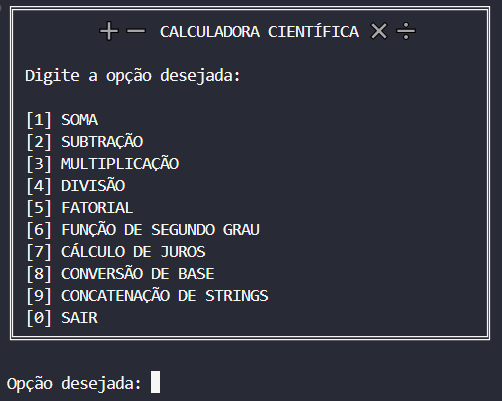
  

  

   

  

    
🛠️ Validação de entrada e tratamento de erros na divisão

    

    

      Uma parte importante da minha atuação no projeto esteve relacionada ao tratamento de entradas inválidas, especialmente na operação de divisão. Em uma aplicação de terminal, onde o usuário interage apenas digitando valores, garantir a validação correta dos dados é essencial para evitar falhas e tornar o sistema mais seguro.
    

  

    Trabalhei em melhorias como a validação da quantidade mínima de números, a verificação de entrada numérica válida, a prevenção de divisão por zero e o cuidado com a exibição do resultado. Essas correções ajudaram a tornar a operação mais robusta e melhoraram a experiência do usuário ao utilizar a calculadora.
  

  
<b>Trecho do código:</b>

      
    <pre><code class="language-js">
      do {
        num = prompt("Quantos números deseja dividir? ");
        validInput = /^\d+$/.test(num);
        quantidade = parseInt(num);

        if (!validInput || isNaN(quantidade) || quantidade &lt;= 1) {
          console.log("Por favor, insira um número válido.");
        }
      } while (!validInput || isNaN(quantidade) || quantidade &lt;= 1);

      if (divisor === 0) {
        console.log("Não é possível dividir por zero. Tente novamente.");
        return;
      }
    </code></pre>

  

    
<b>Exemplo visual:</b>

    
  

  

   

  

    
🛠️ Desenvolvimento de conversões numéricas

    

    

      Também contribuí no desenvolvimento de funcionalidades ligadas às conversões numéricas, como a conversão de binário para octal. Esse tipo de implementação exigiu atenção à lógica de programação, à validação da entrada do usuário e à transformação correta dos valores entre diferentes representações numéricas.
    

  

    Além da lógica principal da conversão, também trabalhei com a validação da entrada binária, evitando que valores inválidos fossem processados. Essa contribuição foi importante para ampliar o conjunto de funcionalidades da calculadora e reforçar meu aprendizado em estruturas condicionais, repetição e manipulação de dados.
  

  
<b>Trecho do código:</b>

    
    <pre><code class="language-js">
      for (let index = 0; index &lt; binario.length; index++) {
        let letraAtual = binario[index];

        if (letraAtual !== "1" &amp;&amp; letraAtual !== "0") {
          valido = "Invalido";
        }
      }

      for (let index = binario.length - 1; index &gt;= 0; index--) {
        if (binario[index] === "1") {
          decimal += 2 ** potencia;
        }
        potencia++;
      }

      do {
        octal = Math.floor(decimal % 8);
        decimal /= 8;
        Resul += octal.toString();
      } while (decimal &gt; 1);
    </code></pre>

  

    
<b>Exemplo visual:</b>

    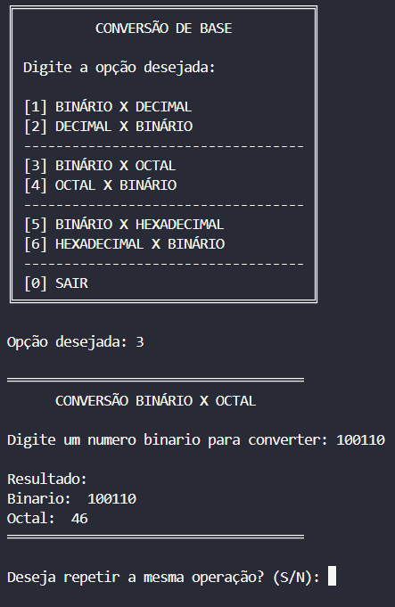
  

  

   

  

  

<h2> 💻 Hard Skills </h2>

  
🛠️ Lógica de programação

  

O desenvolvimento da calculadora foi principalmente uma oportunidade para consolidar minha <strong>lógica de programação</strong>. Ao trabalhar com operações matemáticas, validação de entradas, estruturas condicionais, repetições e conversões entre bases numéricas, precisei aprender a dividir problemas maiores em etapas menores e transformar cada regra em uma sequência de instruções que o programa pudesse executar.

  

  

Um dos principais aprendizados foi entender que fazer uma funcionalidade funcionar é apenas uma parte do desenvolvimento. As situações de entrada inválida e os diferentes caminhos que o usuário poderia seguir me obrigaram a pensar também nos casos que poderiam interromper ou comprometer a execução. A validação da divisão e das conversões numéricas, por exemplo, mostrou na prática a importância de considerar diferentes cenários antes de definir uma solução.

  

  

Essa experiência criou uma base importante para minha evolução como desenvolvedor. Passei a enxergar a programação menos como a escrita de comandos isolados e mais como o processo de <strong>transformar um problema em regras, condições e etapas que possam ser implementadas de forma organizada</strong>.

  

 

  
🛠️ TypeScript básico

  

A evolução do projeto de <strong>VisualG para TypeScript</strong> foi importante para começar a aplicar a lógica que eu já vinha desenvolvendo em uma linguagem mais próxima das ferramentas utilizadas no mercado. Essa mudança também trouxe uma preocupação maior com a organização do código, a definição de funções e a separação das responsabilidades dentro da aplicação.

  

  

Como o projeto possuía diferentes operações e funcionalidades conectadas ao menu principal, comecei a perceber a importância de estruturar o código de maneira que novas funcionalidades pudessem ser adicionadas sem comprometer aquilo que já estava funcionando. Esse contato inicial com TypeScript ajudou a desenvolver minha atenção para <strong>legibilidade, organização e manutenção do código</strong>.

  

  

Ainda considero meu conhecimento de TypeScript inicial, mas essa experiência foi importante porque marcou a transição entre aprender conceitos de programação e começar a aplicá-los em uma linguagem utilizada em projetos de desenvolvimento de software.

  

 

  
🛠️ Git e GitHub

  

O desenvolvimento em equipe também me apresentou de forma mais prática ao <strong>Git e GitHub</strong>. Conforme cada integrante trabalhava em diferentes partes da calculadora, o versionamento deixou de ser apenas uma forma de armazenar o código e passou a fazer parte da organização do próprio projeto.

  

  

Aprendi a utilizar commits, acompanhar alterações, integrar diferentes partes do código e lidar com merges. Esse processo mostrou que o histórico de alterações também é uma ferramenta de colaboração, permitindo entender o que foi modificado e facilitando a integração das contribuições de diferentes integrantes.

  

  

Foi também um primeiro contato com uma prática que se tornou fundamental nos projetos seguintes: <strong>organizar o desenvolvimento de forma que outras pessoas consigam acompanhar, revisar e integrar aquilo que foi produzido</strong>.

  

<h2> 🤝 Soft Skills </h2>

  
🌱 Trabalho em equipe

  

Como a calculadora foi desenvolvida em grupo, precisei aprender que uma contribuição individual não existe de forma isolada. Minha atuação na integração do menu, na validação da divisão e nas conversões numéricas dependia de funcionalidades desenvolvidas por outros integrantes e, ao mesmo tempo, poderia afetar partes do sistema que estavam sob responsabilidade deles.

  

  

Essa dinâmica me fez desenvolver uma visão mais colaborativa sobre o desenvolvimento. Passei a entender a importância de alinhar alterações, comunicar problemas e considerar o impacto das próprias decisões antes de modificar uma parte compartilhada do projeto.

  

  

Mais do que simplesmente dividir tarefas, essa experiência me ensinou que <strong>trabalho em equipe significa construir uma solução em conjunto e assumir responsabilidade também pelo impacto da sua parte no resultado final</strong>.

  

 

  
🌱 Adaptação ao Scrum

  

O projeto foi organizado em <strong>sprints</strong>, o que me permitiu ter meu primeiro contato com uma dinâmica de desenvolvimento baseada em entregas incrementais. Em vez de enxergar a calculadora como uma única entrega, o trabalho foi dividido em etapas que permitiam acompanhar a evolução do produto e organizar as funcionalidades ao longo do semestre.

  

  

Essa experiência me ajudou a entender melhor a importância de acompanhar o progresso do projeto e de adaptar o trabalho conforme as necessidades de cada etapa. Também comecei a perceber como a organização do processo influencia diretamente a capacidade do time de entregar funcionalidades de forma progressiva.

  

  

O contato com Scrum foi importante para desenvolver uma postura mais <strong>organizada e adaptável</strong>, principalmente por mostrar que desenvolvimento de software envolve não apenas programação, mas também planejamento, acompanhamento e colaboração contínua.

  

 

  
🌱 Padronização e disciplina no desenvolvimento

  

Outro aprendizado importante foi perceber que a qualidade de uma aplicação não depende apenas de suas funcionalidades. Conforme o projeto cresceu, comecei a prestar mais atenção na organização do código, na estrutura das funções, na forma como as alterações eram versionadas e na maneira como as diferentes partes da aplicação se conectavam.

  

  

As situações de validação e tratamento de erros foram especialmente importantes nesse sentido. Elas mostraram que uma solução precisa considerar não apenas o cenário esperado, mas também as situações em que o usuário fornece uma entrada incorreta ou tenta realizar uma operação que não pode ser executada.

  

  

Essa experiência contribuiu para desenvolver uma primeira noção de <strong>qualidade e disciplina no desenvolvimento</strong>. Comecei a entender que escrever código é também estabelecer padrões que facilitem sua leitura, manutenção e evolução.

  

<h2> 📚 Competências desenvolvidas </h2>

<h3>💻 Competências técnicas</h3>

<table>
  <thead>
    <tr><th>Competência</th><th>Nível</th></tr>
  </thead>
  <tbody>
    <tr><td>Lógica de programação</td><td>básico/intermediário</td></tr>
    <tr><td>TypeScript</td><td>básico</td></tr>
    <tr><td>Git e GitHub</td><td>básico/intermediário</td></tr>
    <tr><td>Estruturas condicionais e funções</td><td>básico/intermediário</td></tr>
    <tr><td>Validação de entradas</td><td>básico/intermediário</td></tr>
    <tr><td>Tratamento de erros</td><td>básico/intermediário</td></tr>
    <tr><td>Modularização de código</td><td>básico</td></tr>
    <tr><td>Aplicações de terminal</td><td>básico/intermediário</td></tr>
    <tr><td>Conversão entre bases numéricas</td><td>básico/intermediário</td></tr>
  </tbody>
</table>

<h3>🤝 Soft Skills trabalhadas</h3>

Esse projeto desenvolveu principalmente minha <strong>capacidade de colaboração, adaptação e organização</strong>. Trabalhar em uma aplicação construída por várias pessoas mostrou que o desenvolvimento exige comunicação constante e atenção ao impacto que cada alteração pode causar nas demais partes do sistema.

Também desenvolvi uma visão mais estruturada sobre <strong>processos de desenvolvimento</strong>. O contato com sprints, entregas incrementais e versionamento mostrou que construir software envolve muito mais do que implementar funcionalidades: é necessário organizar o trabalho, acompanhar sua evolução e integrar diferentes contribuições em uma única solução.

Por fim, a experiência ajudou a desenvolver minha <strong>disciplina técnica</strong>. Ao lidar com validações, tratamento de erros, organização do código e integração de funcionalidades, comecei a entender que uma boa implementação precisa considerar tanto o funcionamento esperado quanto os cenários que podem gerar problemas. Foi uma experiência inicial, mas importante para estabelecer a base técnica e profissional que seria aprofundada nos projetos seguintes.

<!-- 2º Semestre -->

 <h1>2º Semestre • 2/2024</h1>

  <h3><a href="https://github.com/Steam-Ducks/pacer-assessment-system" target="_blank">PACER Assessment System</a></h3>
  
<i>Sistema desktop desenvolvido para apoiar a avaliação de integrantes de equipe com base em critérios definidos pelo administrador, incluindo autenticação, gestão de grupos, critérios e relatórios.</i>

   
  
   
  

    
  

  
Detalhes do Projeto

  

    
  

  

    No segundo semestre de 2024, desenvolvemos o <b>PACER Assessment System</b>, um sistema desktop criado para permitir a avaliação de integrantes de grupo com base em critérios previamente definidos. O projeto foi construído em contexto acadêmico e tinha como objetivo tornar o processo de avaliação mais estruturado, transparente e organizado.
  

  

    A aplicação contemplava funcionalidades como autenticação de usuários, gerenciamento de grupos, definição de critérios de avaliação, cadastro de sprints e geração de relatórios. Além disso, o projeto também envolveu uma etapa importante de modelagem de dados e documentação, garantindo que a solução estivesse bem definida tanto do ponto de vista funcional quanto estrutural.
  

  

    Atuei como <b>Product Owner</b>, sendo responsável por apoiar a organização do produto e por manter a documentação atualizada ao longo do desenvolvimento. Minha atuação esteve mais concentrada na definição e no acompanhamento dos artefatos do projeto do que na implementação em código, contribuindo para que o time tivesse clareza sobre a evolução das entregas e sobre a visão geral do sistema.
  

  

    
  

  

    
  

   

  

    
🛠️ Atuação como Product Owner na organização do produto

    

    

      Minha principal contribuição neste projeto foi atuar como Product Owner, ajudando a organizar a visão do produto ao longo do semestre. Essa atuação envolveu acompanhar a estrutura geral do sistema, apoiar a definição das entregas e manter coerência entre o que estava sendo desenvolvido e o que o projeto precisava entregar.
    

    

      Como o sistema possuía diferentes módulos (autenticação, grupos, critérios, sprints e relatórios), foi importante garantir que a evolução das funcionalidades estivesse alinhada ao objetivo central da aplicação. Essa experiência me ajudou a entender melhor a responsabilidade de organizar o produto para o time e de acompanhar sua construção de forma mais estratégica.
    

    

      
<b>Exemplo visual:</b>

      
    

  

   

  

    
🛠️ Documentação contínua do projeto

    

    

      Outra contribuição importante foi a manutenção da documentação do projeto ao longo do desenvolvimento. Pelo histórico do repositório, minha participação esteve fortemente ligada à atualização do README, à organização de arquivos e à publicação de artefatos importantes para a apresentação e o entendimento do sistema.
    

    

      Esse trabalho foi relevante porque ajudou a consolidar a visão do projeto, registrar sua evolução e tornar mais fácil a comunicação das funcionalidades e requisitos para quem fosse consultar o repositório. Além disso, a documentação também teve papel importante na apresentação acadêmica do sistema e na formalização dos resultados da equipe.
    

    

      
<b>Exemplo visual:</b>

      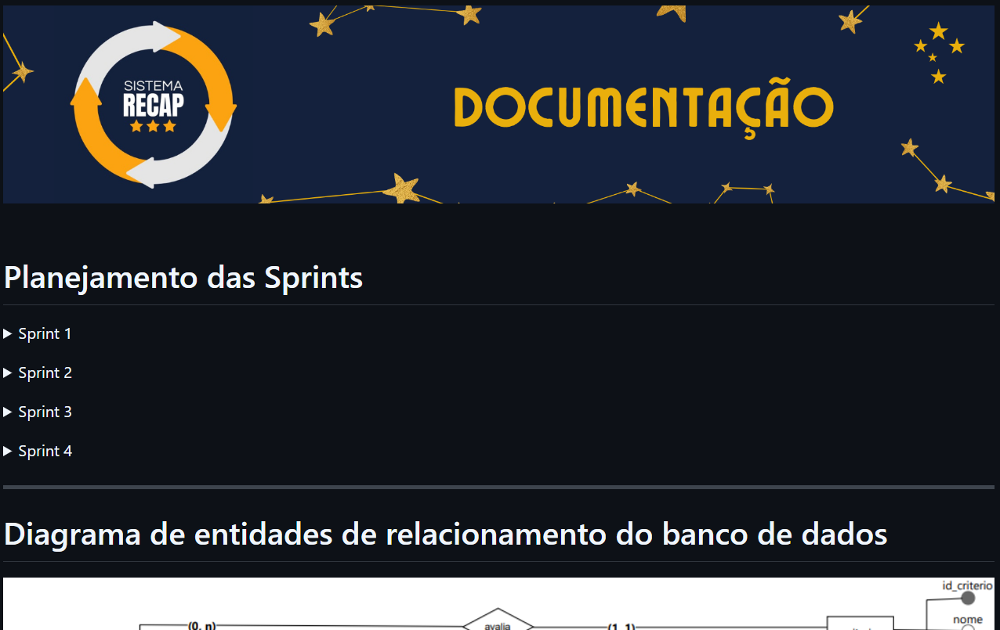
    

  

   

  

    
🛠️ Escrita das user stories e organização de artefatos de acompanhamento

    

    

      Também fui responsável por escrever as user stories do projeto, descrevendo as funcionalidades a partir da perspectiva do usuário para orientar o desenvolvimento do time. Além disso, contribuí com a organização de artefatos que apoiavam o acompanhamento do projeto, como gráficos de burndown, wireframes e outros materiais visuais e estruturais. Vale destacar que os wireframes não foram elaborados por mim, mas por outros integrantes do time; minha atuação sobre eles foi de organização e publicação no repositório. Esses elementos eram importantes para acompanhar a evolução das entregas e comunicar melhor o planejamento e a proposta da solução.
    

    

      O wireframe ajudava a representar visualmente a estrutura esperada do sistema, enquanto o burndown funcionava como evidência do acompanhamento do progresso das sprints. Esse tipo de contribuição reforçou minha atuação mais voltada à organização do produto, ao planejamento e ao acompanhamento do time.
    

    

      
<b>Exemplo visual:</b>

      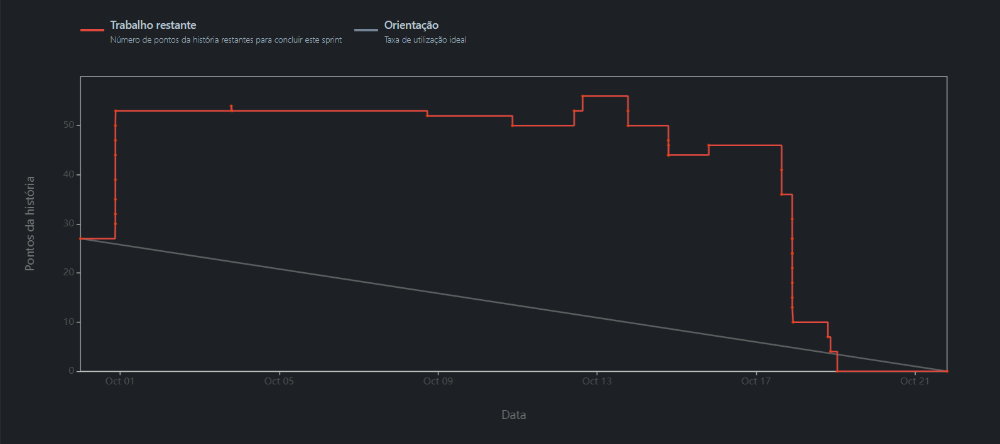
    

  

   

  

  

  

  <h2> 💻 Hard Skills </h2>

  

    
🛠️ Product Owner e gestão de produto

    

      O segundo semestre marcou uma mudança importante na minha trajetória dentro dos projetos acadêmicos: passei a atuar como <strong>Product Owner</strong>. Depois de ter uma experiência mais voltada ao desenvolvimento no semestre anterior, comecei a enxergar o projeto não apenas pela perspectiva de implementação, mas também pela necessidade de entender o produto como um todo.
    

    

      Também comecei a compreender melhor o papel do Product Owner como uma ponte entre a necessidade do produto e o trabalho do time. Mesmo estando em uma experiência acadêmica e inicial nessa função, esse foi um primeiro contato importante com <strong>priorização, organização de entregas, acompanhamento de requisitos e tomada de decisões sob a perspectiva do produto</strong>.
    

  

   
  
  

    
🛠️ Documentação de software

    

      A documentação passou a ter uma importância muito maior na minha atuação durante esse projeto. Diferentemente do semestre anterior, em que minha contribuição estava mais concentrada na implementação de funcionalidades, no PACER precisei manter informações do projeto organizadas e atualizadas para que outras pessoas conseguissem compreender a solução e acompanhar sua evolução.
    

    

      Trabalhar com README, artefatos de planejamento e materiais utilizados durante as apresentações me mostrou que documentação não é apenas um registro complementar ao desenvolvimento. Ela também funciona como uma forma de <strong>preservar contexto, comunicar decisões e tornar o produto compreensível para diferentes pessoas</strong>.
    

    

      Essa experiência desenvolveu minha capacidade de transformar informações do projeto em uma documentação mais estruturada, algo que se tornou especialmente relevante para minha atuação posterior em funções que envolvem requisitos, organização e comunicação entre diferentes áreas.
    

  

    

  

    
🛠️ Modelagem e visão estrutural de sistemas

    

      Mesmo não estando diretamente responsável pela implementação do sistema, acompanhar sua construção me aproximou de diferentes artefatos utilizados para representar uma solução, como <strong>DER, wireframes e estruturas funcionais</strong>. Isso me permitiu desenvolver uma visão mais ampla sobre como uma necessidade pode ser representada antes ou durante sua transformação em software.
    

    

      Esse contato foi importante porque comecei a enxergar a relação entre diferentes níveis do projeto: requisitos, experiência do usuário, estrutura de dados e funcionalidades. Como Product Owner, essa compreensão ajudava a acompanhar o desenvolvimento sem precisar estar diretamente envolvido em cada implementação.
    

    

      Foi também um passo importante para desenvolver minha capacidade de <strong>ler e interpretar artefatos técnicos</strong>, conectando aquilo que estava sendo documentado com o comportamento esperado do produto.
    

  

   

  

    
🛠️ Acompanhamento de projetos em Scrum

    

      O contato com Scrum também ganhou uma nova dimensão neste semestre. No primeiro projeto, eu havia experimentado o processo principalmente como desenvolvedor. Agora, como Product Owner, passei a observar as sprints e as entregas a partir de uma perspectiva diferente, mais relacionada à organização e à evolução do produto.
    

    

      Acompanhar burndown, artefatos, entregas e o andamento das funcionalidades me ajudou a compreender melhor como o progresso do time pode ser acompanhado ao longo de um ciclo de desenvolvimento. Também percebi que planejamento e acompanhamento precisam estar conectados ao objetivo do produto, e não apenas à quantidade de tarefas concluídas.
    

    

      Essa experiência ampliou minha compreensão sobre <strong>desenvolvimento ágil</strong> e me deu uma visão inicial de como diferentes papéis dentro de um time contribuem para transformar uma ideia em uma entrega estruturada.
    

  

  <h2> 🤝 Soft Skills </h2>
  

    
🌱 Comunicação e alinhamento

    

      Atuar como Product Owner fez com que a <strong>comunicação</strong> passasse a ter um papel muito mais central no meu trabalho. Eu precisava acompanhar o que estava sendo desenvolvido, entender o estado do produto e garantir que as informações importantes estivessem claras para o restante da equipe.
    

    

      Isso me fez desenvolver uma comunicação mais objetiva e orientada ao contexto. Passei a perceber que não basta transmitir uma informação; é necessário entender o que a outra pessoa precisa saber para conseguir executar sua parte do trabalho ou tomar uma decisão.
    

    

      Essa experiência foi importante para desenvolver minha capacidade de <strong>alinhar diferentes perspectivas dentro de uma equipe</strong>, algo que se tornou especialmente relevante para minha evolução como profissional de tecnologia.
    

  

   

  

    
🌱 Organização

    

      A responsabilidade sobre documentação e artefatos de acompanhamento também exigiu um nível maior de <strong>organização</strong>. Com diferentes módulos, entregas e materiais sendo desenvolvidos ao mesmo tempo, precisei manter uma visão geral do projeto e evitar que informações importantes ficassem dispersas.
    

    

      Esse processo me mostrou que organização não significa apenas manter arquivos ou tarefas em ordem. Também envolve saber quais informações são relevantes, onde elas devem estar registradas e como facilitar o acesso a elas quando o time precisar.
    

    

      Foi um aprendizado importante para começar a desenvolver uma postura mais estruturada diante de projetos com múltiplas frentes e diferentes necessidades de acompanhamento.
    

  

    

  

    
🌱 Visão de produto

    

      A principal soft skill desenvolvida neste semestre foi minha <strong>visão de produto</strong>. Ao assumir o papel de Product Owner, precisei deixar de olhar exclusivamente para a implementação e começar a considerar o sistema como uma solução completa, com objetivo, usuários, funcionalidades e prioridades.
    

    

      Essa mudança de perspectiva me ajudou a entender que uma boa solução não é necessariamente aquela que possui mais funcionalidades, mas aquela em que as diferentes partes fazem sentido dentro do objetivo que o produto pretende alcançar. Passei a observar mais a relação entre necessidade, requisito, funcionalidade e entrega.
    

    

      Foi um primeiro passo importante para desenvolver <strong>senso de prioridade, visão sistêmica e capacidade de tomar decisões considerando o produto como um todo</strong>.
    

  

   

  

    
🌱 Responsabilidade e autonomia

    

      Assumir uma função diferente da que eu havia exercido no semestre anterior também exigiu mais <strong>autonomia</strong>. Como Product Owner, eu precisava acompanhar o projeto de forma contínua, identificar o que precisava ser organizado e contribuir para que o time tivesse uma visão clara do produto.
    

    

      Essa experiência me tirou um pouco da posição de apenas executar uma tarefa previamente definida e me colocou em uma situação em que eu precisava entender o contexto antes de decidir como contribuir. Isso desenvolveu minha capacidade de assumir responsabilidade sobre uma área do projeto e buscar as informações necessárias para desempenhar esse papel.
    

    

      Foi uma experiência importante para começar a construir uma postura mais <strong>proativa e orientada à responsabilidade</strong>, especialmente em situações nas quais nem todas as respostas estavam previamente definidas.
    

  

  <h2> 📚 Competências desenvolvidas </h2>

  <h3>💻 Competências técnicas</h3>

  <table>
    <thead>
      <tr><th>Competência</th><th>Nível</th></tr>
    </thead>
    <tbody>
      <tr><td>Product Owner</td><td>básico/intermediário</td></tr>
      <tr><td>Gestão de produto</td><td>básico/intermediário</td></tr>
      <tr><td>Scrum e desenvolvimento ágil</td><td>básico/intermediário</td></tr>
      <tr><td>Documentação de software</td><td>intermediário</td></tr>
      <tr><td>README e documentação técnica</td><td>intermediário</td></tr>
      <tr><td>Modelagem de sistemas</td><td>básico/intermediário</td></tr>
      <tr><td>DER</td><td>básico</td></tr>
      <tr><td>Wireframes</td><td>básico/intermediário</td></tr>
      <tr><td>Burndown e acompanhamento de sprints</td><td>básico/intermediário</td></tr>
      <tr><td>Análise e organização de requisitos</td><td>básico/intermediário</td></tr>
    </tbody>
  </table>

  <h3>🤝 Soft Skills trabalhadas</h3>
  

    Esse semestre representou uma mudança importante na minha forma de participar de um projeto. Depois de ter atuado principalmente como desenvolvedor no primeiro semestre, assumir o papel de <strong>Product Owner</strong> me obrigou a desenvolver uma visão mais ampla, considerando não apenas como uma funcionalidade seria implementada, mas também qual era seu propósito dentro do produto.
  

  

    A experiência desenvolveu principalmente minha <strong>comunicação, organização e visão sistêmica</strong>. Precisei acompanhar diferentes partes do projeto, manter informações documentadas e contribuir para que o time tivesse clareza sobre a solução que estava sendo construída.
  

  

    Também foi um momento importante para desenvolver <strong>autonomia e responsabilidade</strong>. Como PO, passei a ter uma participação mais ativa na organização do produto e comecei a entender melhor como decisões de negócio, requisitos, documentação e desenvolvimento se conectam dentro de um projeto de software.
  

  

    Se o primeiro semestre foi principalmente sobre aprender a <strong>construir software</strong>, este segundo semestre começou a me ensinar a <strong>entender, organizar e direcionar o software que está sendo construído</strong>. Essa mudança de perspectiva foi uma das principais contribuições do PACER para minha formação.
  

<!-- 3º Semestre -->

 <h1>3º Semestre • 1/2025</h1>

  <h3><a href="https://github.com/Steam-Ducks/point-system" target="_blank">Pontual - Sistema de Ponto</a></h3>
  
<i>Aplicação web desenvolvida para monitorar as horas trabalhadas de funcionários de empresas terceirizadas, com cadastros, relatórios e dashboards interativos.</i>

   
  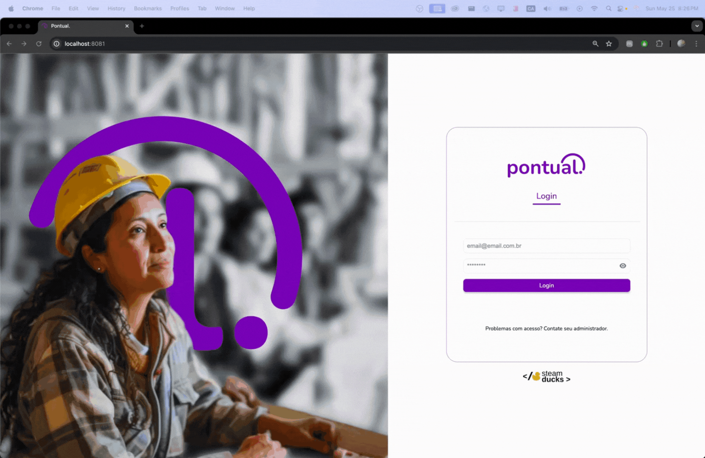
   
  

    
  

  
Detalhes do Projeto

  

    
  

  

    No primeiro semestre de 2025, desenvolvemos o <b>Pontual</b>, uma aplicação web criada para monitorar as horas trabalhadas de funcionários de empresas terceirizadas. O projeto foi desenvolvido para a <b>Altave</b>, empresa que atua com coleta de imagens e reconhecimento facial e que hoje aplica essa tecnologia em contextos de segurança, como plataformas petrolíferas.
  

  

    O cenário apresentado pelo cliente envolvia um estaleiro, onde empresas terceiras realizam manutenção em navios. As câmeras da Altave identificam os colaboradores e enviam essas informações para o sistema, que registra os pontos, calcula as horas trabalhadas e gera o valor do salário individualmente. A partir disso, construímos uma interface para cadastro de empresas e profissionais, filtros de dados, extração de relatórios e dashboards interativos.
  

  

    Atuei como <b>desenvolvedor full stack</b>, contribuindo com a estruturação do frontend em Vue.js, a integração com a API, o desenvolvimento de classes e serviços no backend e a construção da folha de ponto. Um dos principais desafios foi lidar com funcionários em escalas noturnas e permitir a edição das marcações já registradas.
  

  

    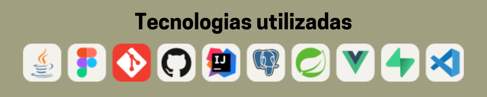
  

  

    
  

   

  

    
🛠️ Estruturação do projeto em Vue.js

    

    

      Uma das minhas principais contribuições foi a estruturação inicial do projeto no frontend. Organizei a arquitetura de pastas, defini as rotas da aplicação e estabeleci padrões de código para garantir consistência entre os módulos e maior legibilidade, facilitando a navegação e a manutenção ao longo do desenvolvimento.
    

    

      Também desenvolvi os layouts principais e os componentes reutilizáveis da interface. Esse trabalho ajudou a manter uma experiência visual coerente entre as telas e reduziu o tempo de desenvolvimento das funcionalidades implementadas nas sprints seguintes.
    

    
<b>Trecho do código (arquivo de rotas):</b>

    
    <pre><code class="language-js">import UserPage from '@/views/users/UserIndex.vue';
      import Test from '@/components/Test.vue';
      import LoginPage from '@/views/auth/AuthIndex.vue';
      import admintLayout from "@/layout/AdmintLayout.vue";
      import PositionPage from '@/views/position/PositionIndex.vue';

      const routes = [
        {
          path: '/',
          name: 'Login',
          component: LoginPage,
        },
        {
          path: '/home',
          name: 'Home',
          meta: { requiresAuth: true },
          component: admintLayout,
          children: [
            {
              path: '',
              component: HomePage
            }
          ]
        },
        {
          path: '/user',
          component: AdminLayout,
          meta: { requiresAuth: true },
          children: [
            {
              path: '',
              component: UserPage,
            },
          ],
        }
        ...
    ];</code></pre>

  

    
<b>Exemplo visual:</b>

    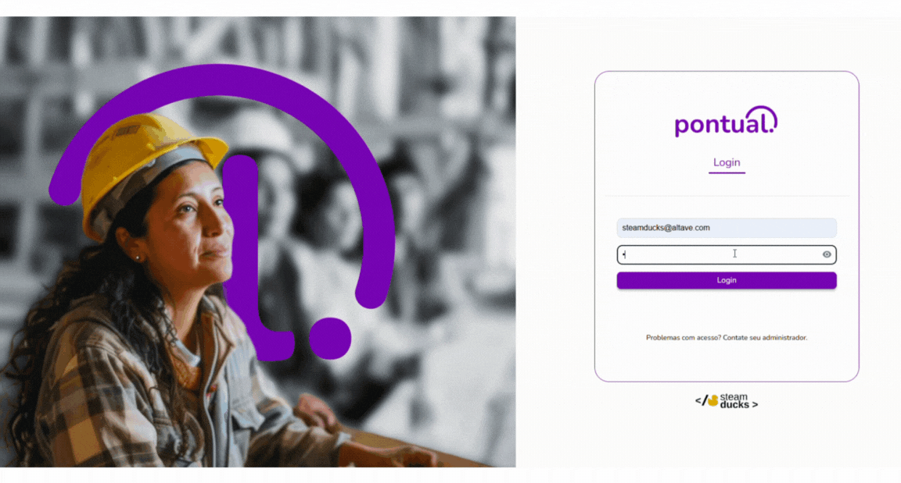
  

  

   

  

    
🛠️ Integração do frontend com o backend

    

    

      Implementei a comunicação entre o frontend e a API, garantindo o consumo dos endpoints responsáveis pela exibição e pela manipulação dos dados da aplicação. Esse trabalho envolveu tratar formatos de data, padronizar as chamadas e centralizar a lógica de acesso aos serviços.
    

    

      Também configurei interceptadores de requisição e resposta para gerenciar automaticamente os tokens de autenticação e lidar com erros de forma centralizada. Essa abordagem tornou o fluxo de dados mais robusto, padronizado e fácil de manter ao longo do desenvolvimento.
    

    
<b>Trecho do código (TimeRecordService.js):</b>

    <pre><code class="language-js">import axios from 'axios';
      import UserService from './UserService';

      const API_URL = 'http://localhost:8080/api/timerecords';

      const formatToLocalDateTimeString = (dateInput) =&gt; {
        let date;
        if (dateInput instanceof Date) {
          date = dateInput;
        } else if (typeof dateInput === 'string') {
          if (/^\d{4}-\d{2}-\d{2}$/.test(dateInput)) {
            return `${dateInput}`;
          }
          date = new Date(dateInput);
        } else {
          console.warn("Tipo de data inválido recebido:", dateInput);
          return null;
        }
        if (!date || isNaN(date.getTime())) {
          console.warn("Não foi possível parsear a data:", dateInput);
          return null;
        }
      };</code></pre>

  

    
<b>Exemplo visual:</b>

    
  

  

   

  

    
🛠️ Desenvolvimento de classes e serviços no backend

    

    

      No backend, desenvolvi classes e serviços responsáveis por organizar a lógica de negócio e facilitar a comunicação entre os diferentes módulos da aplicação. Estruturei os services de forma modular, promovendo a reutilização de código e a separação de responsabilidades.
    

    

      Também integrei o projeto ao banco de dados online <b>Supabase</b>, configurando a conexão e implementando operações de leitura, escrita e atualização dos dados. Essa integração garantiu maior escalabilidade e eficiência no gerenciamento das informações do sistema.
    

    
<b>Trecho do código (EmployeeController.java):</b>
  
        
      <pre><code class="language-java">public class EmployeeController {
        @Autowired
        private final EmployeeService employeeService;
        private final SupabaseStorageService supabaseStorageService;

        public EmployeeController(EmployeeService employeeService, SupabaseStorageService supabaseStorageService) {
            this.employeeService = employeeService;
            this.supabaseStorageService = supabaseStorageService;
        }

        @PostMapping
        public ResponseEntity&lt;?&gt; createEmployee(@RequestBody EmployeeDto employeeDto) {
            try {
                int employeeId = employeeService.createEmployee(employeeDto);
                return ResponseEntity.status(HttpStatus.CREATED)
                        .body(Map.of("id", employeeId));
            } catch (IllegalArgumentException e) {
                return ResponseEntity.status(HttpStatus.BAD_REQUEST)
                        .body(Map.of("message", e.getMessage()));
            } catch (ResponseStatusException e) {
                return ResponseEntity.status(HttpStatus.NOT_FOUND)
                        .body(Map.of("message", e.getReason()));
            } catch (Exception e) {
                return ResponseEntity.status(HttpStatus.INTERNAL_SERVER_ERROR)
                        .body(Map.of("message", "Erro ao criar um novo funcionário. Tente novamente."));
            }
        }

        @PostMapping("/uploadPhoto")
        public ResponseEntity&lt;?&gt; uploadEmployeePhoto(@RequestParam("file") MultipartFile file) {
            try {
                String photoUrl = supabaseStorageService.uploadEmployeePhoto(file);
                return ResponseEntity.ok(Map.of("photoUrl", photoUrl));
            } catch (Exception e) {
                return ResponseEntity.status(HttpStatus.INTERNAL_SERVER_ERROR)
                        .body(Map.of("message", "Erro no upload de foto"));
            }
        }
      }</code></pre>

  
<b>Trecho do código (application.properties):</b>

  
    <pre><code class="language-properties">spring.jpa.database=postgresql
      spring.jpa.database-platform=org.hibernate.dialect.PostgreSQLDialect
      spring.jpa.hibernate.ddl-auto=none
      spring.jpa.show-sql=true
      supabase.auth.token=Bearer eyJhbGciOiJIUzI1NiIsInR5cCI6IkpXVCJ9...
      spring.datasource.url=jdbc:postgresql://aws-0-sa-east-1.pooler.supa...
      spring.datasource.username=postgres...
      spring.datasource.password=********
      spring.datasource.driver-class-name=org.postgresql.Driver
    </code></pre>

  

    
<b>Exemplo visual:</b>

    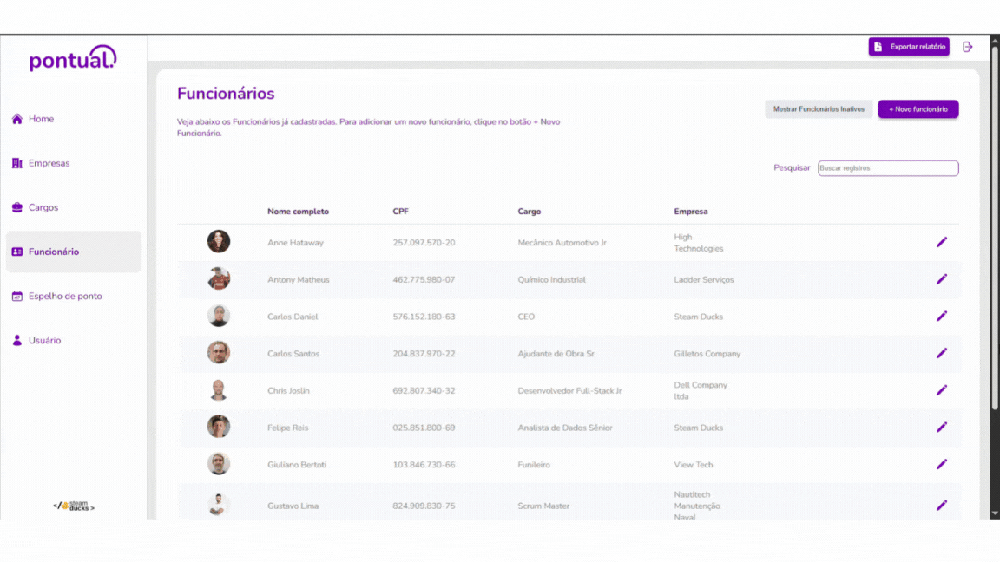
  

  

   

  

    
🛠️ Criação da folha de ponto

    

    

      Desenvolvi a lógica responsável pelo cálculo e pela exibição dos pontos na interface. Implementei funções para processar os dados de entrada, realizar os cálculos de horas trabalhadas e gerar os resultados apresentados ao usuário em tempo real.
    

    

      Também estruturei o código para que os registros fossem renderizados corretamente nas telas, mantendo coerência visual e atualização automática das informações conforme as ações realizadas. Essa foi uma das partes mais desafiadoras do projeto, por envolver escalas noturnas e marcações que atravessavam a meia-noite.
    

    
<b>Trecho do código (TimeRecordIndex.vue):</b>

    
    <pre><code class="language-js">computed: 
    {
      // Lista os funcionários no select
      employeeslist() {
        return this.employees.map((employee) =&gt; ({
          id: employee.id,
          name: employee.name,
        }));
      },
      hasAnyEntrada2() {
        return this.processedTimeRecords.some(record =&gt; record.entrada2);
      },
      hasAnyEntrada3() {
        return this.processedTimeRecords.some(record =&gt; record.entrada3);
      },
      totalWorkedPeriod() {
        if (!this.processedTimeRecords || this.processedTimeRecords.length === 0) {
          return '00:00';
        }
        const totalMinutes = this.processedTimeRecords.reduce((sum, record) =&gt; {
          const [hours, minutes] = record.totalTrabalhadoDia.split(':').map(Number);
          return sum + (hours * 60) + minutes;
        }, 0);
        const hours = Math.floor(totalMinutes / 60);
        const minutes = totalMinutes % 60;
        return `${String(hours).padStart(2, '0')}:${String(minutes).padStart(2, '0')}`;
      },
    }
    </code></pre>

  

      
<b>Exemplo visual:</b>

      
    

  

   

  

    
  

  <h2> 💻 Hard Skills </h2>

  

    
🛠️ Vue.js e arquitetura de frontend

    

    

      O desenvolvimento do Pontual foi meu primeiro contato mais aprofundado com a construção de uma aplicação web utilizando <strong>Vue.js</strong>. Mais do que desenvolver telas individualmente, precisei entender como estruturar um frontend de médio porte para que diferentes páginas, rotas e componentes pudessem funcionar de maneira organizada e consistente.
    

    

      A necessidade de trabalhar com diferentes módulos me levou a pensar em <strong>arquitetura de frontend</strong>, organização de pastas, rotas, layouts e componentes reutilizáveis. Comecei a perceber que, conforme uma aplicação cresce, simplesmente adicionar novas telas pode gerar complexidade e retrabalho se não houver uma estrutura definida desde o início.
    

    

      Essa experiência foi importante para desenvolver uma visão mais madura sobre frontend. Passei a considerar não apenas a aparência ou o funcionamento individual de uma tela, mas também como os componentes se relacionam, como o usuário navega pela aplicação e como a estrutura escolhida pode facilitar a manutenção e a evolução do sistema.
    

  

   

  

    
🛠️ Integração entre frontend e backend

    

    

      Uma das principais evoluções técnicas deste semestre foi aprender a trabalhar com a comunicação entre <strong>frontend e backend</strong>. Até então, minha experiência estava mais concentrada na lógica e na construção de aplicações menores. No Pontual, precisei consumir uma API real e transformar os dados recebidos em informações úteis para as telas da aplicação.
    

    

      Esse processo envolveu lidar com requisições, respostas, autenticação, formatos de data e tratamento de erros. Também precisei organizar a comunicação com os serviços de maneira centralizada, utilizando interceptadores para lidar com tokens e situações de erro de forma mais consistente.
    

    

      Essa experiência mudou minha compreensão sobre aplicações web porque comecei a enxergar o sistema como um conjunto de camadas que precisam se comunicar corretamente. Uma tela funcionando não dependia apenas do frontend, mas também da disponibilidade da API, da estrutura dos dados e da forma como essas informações eram processadas entre as diferentes partes da aplicação.
    

  

   

  

    
🛠️ Java Spring Boot e desenvolvimento de backend

    

    

      No backend, tive contato mais aprofundado com <strong>Java e Spring Boot</strong>, trabalhando com controllers, services e organização da lógica de negócio. Essa experiência foi importante porque me permitiu sair de uma visão limitada ao consumo de APIs e começar a compreender também o que acontece por trás das requisições realizadas pelo frontend.
    

    

      Ao desenvolver classes e serviços, comecei a aplicar conceitos de <strong>separação de responsabilidades e modularização</strong>. A lógica precisava estar organizada de forma que diferentes partes do sistema pudessem ser mantidas e modificadas sem concentrar todo o comportamento em um único ponto.
    

    

      Também tive contato com tratamento de exceções e diferentes respostas HTTP, entendendo melhor como o backend deve comunicar erros e resultados para quem está consumindo a API. Essa experiência contribuiu para desenvolver uma visão mais completa do ciclo de uma requisição, desde a interação do usuário até o processamento e persistência dos dados.
    

  

   

  

    
🛠️ PostgreSQL, Supabase e persistência de dados

    

    

      O projeto também ampliou meu contato com <strong>bancos de dados relacionais</strong>. Trabalhei com PostgreSQL através do Supabase, participando da integração entre a aplicação e a camada responsável pela persistência das informações.
    

    

      A necessidade de consultar funcionários, registros de ponto e outras informações do sistema me ajudou a compreender melhor como os dados utilizados pela interface são armazenados e recuperados. Também comecei a perceber a importância de estruturar as consultas de acordo com a necessidade real da aplicação, principalmente quando os dados precisam ser filtrados, agrupados ou processados antes de serem apresentados ao usuário.
    

    

      Essa experiência foi importante para fortalecer minha compreensão sobre o caminho dos dados dentro de uma aplicação: <strong>o usuário gera uma ação, o frontend realiza uma requisição, o backend processa a regra de negócio, o banco fornece ou armazena os dados e o resultado retorna para a interface</strong>.
    

  

   

  

    
🛠️ Desenvolvimento de regras de negócio e folha de ponto

    

    

      O desenvolvimento da folha de ponto foi uma das experiências mais importantes do projeto para minha evolução técnica. A funcionalidade parecia inicialmente simples, mas envolvia regras específicas para calcular horas trabalhadas e apresentar os registros corretamente, principalmente em situações em que a jornada de trabalho atravessava a meia-noite.
    

    

      Para resolver esse tipo de cenário, precisei analisar os dados recebidos, entender como os horários deveriam ser interpretados e estruturar a lógica de cálculo de maneira que diferentes combinações de marcações fossem tratadas corretamente. Isso exigiu mais atenção aos casos de borda e mostrou, na prática, como uma regra de negócio aparentemente simples pode gerar desafios técnicos quando aplicada a situações reais.
    

    

      Essa experiência fortaleceu minha capacidade de transformar uma necessidade do negócio em uma implementação técnica. Mais do que escrever funções para calcular horários, precisei compreender <strong>qual comportamento o sistema deveria apresentar em cada cenário</strong> e garantir que essa regra fosse refletida corretamente no código.
    

  

  <h2> 🤝 Soft Skills </h2>
  

    
🌱 Colaboração técnica

    

    

      Trabalhar no Pontual exigiu uma colaboração mais próxima entre diferentes partes do desenvolvimento. Como o projeto possuía frontend, backend, banco de dados e diferentes módulos funcionais, minhas alterações precisavam considerar o trabalho realizado pelos outros integrantes e a forma como as partes do sistema se conectavam.
    

    

      Também auxiliei colegas durante o desenvolvimento, discutindo soluções, revisando abordagens e ajudando a resolver problemas encontrados ao longo das sprints. Isso me mostrou que conhecimento técnico também pode ser compartilhado dentro do time e que ajudar outra pessoa a encontrar uma solução pode ser tão importante quanto concluir a própria tarefa.
    

    

      Essa experiência desenvolveu minha capacidade de <strong>colaborar tecnicamente sem perder de vista o objetivo coletivo</strong>, algo especialmente importante em projetos nos quais diferentes pessoas trabalham simultaneamente sobre partes relacionadas do sistema.
    

  

   

  

    
🌱 Resolução de problemas complexos

    

    

      O Pontual trouxe problemas mais próximos daqueles encontrados em aplicações reais. Um dos principais exemplos foi o tratamento de jornadas noturnas e registros de ponto que atravessavam a meia-noite. A solução não poderia considerar apenas o cenário mais simples; era necessário analisar diferentes possibilidades e garantir que os cálculos permanecessem corretos.
    

    

      Esse tipo de problema exigiu que eu dividisse a situação em partes menores, identificasse os casos que poderiam gerar inconsistências e testasse diferentes possibilidades antes de chegar a uma implementação adequada. Comecei a desenvolver uma abordagem mais sistemática para problemas técnicos, em vez de tentar resolver tudo diretamente no código.
    

    

      Essa experiência fortaleceu principalmente minha <strong>capacidade analítica</strong>. Passei a entender melhor que problemas complexos normalmente precisam ser decompostos antes de serem implementados e que considerar casos de borda faz parte da construção de uma solução confiável.
    

  

   

  

    
🌱 Planejamento e antecipação

    

    

      A participação em discussões de planejamento e brainstorming também me ajudou a desenvolver uma postura mais preventiva durante o desenvolvimento. Ao discutir telas, fluxos e funcionalidades antes da implementação, comecei a perceber que algumas decisões tomadas antecipadamente poderiam evitar problemas e retrabalho nas etapas seguintes.
    

    

      Isso ficou especialmente evidente em funcionalidades que possuíam regras mais complexas. Pensar previamente sobre os diferentes cenários de uso permitia identificar dificuldades antes que elas chegassem à implementação, facilitando a divisão das tarefas e a definição de uma solução mais consistente.
    

    

      Essa experiência me ensinou a valorizar mais o <strong>planejamento técnico</strong>. Nem todo problema precisa ser resolvido durante a codificação; muitas vezes, entender corretamente o problema antes de começar a implementar já reduz uma parte significativa da complexidade.
    

  

   

  

    
🌱 Visão sistêmica

    

    

      O maior salto de maturidade deste semestre foi começar a desenvolver uma <strong>visão sistêmica</strong> sobre uma aplicação. Diferentemente dos projetos anteriores, em que eu conseguia enxergar a maior parte da solução de forma mais localizada, o Pontual exigia compreender como frontend, backend, banco de dados, autenticação e regras de negócio funcionavam em conjunto.
    

    

      Uma alteração em uma camada poderia afetar outra. Um dado retornado de forma diferente pela API poderia exigir mudanças no frontend, enquanto uma regra de negócio mal definida poderia comprometer tanto o processamento quanto a apresentação das informações. Essa relação entre as diferentes partes me fez pensar mais no sistema como um todo.
    

    

      Essa visão foi importante para minha evolução porque comecei a deixar de enxergar desenvolvimento apenas como a implementação de funcionalidades isoladas. Passei a compreender melhor que <strong>uma aplicação é um conjunto de componentes interdependentes e que uma boa solução precisa considerar essas relações</strong>.
    

  

  <h2> 📚 Competências desenvolvidas </h2>

  <h3>💻 Competências técnicas</h3>

  <table>
    <thead>
      <tr><th>Competência</th><th>Nível</th></tr>
    </thead>
    <tbody>
      <tr><td>Vue.js</td><td>intermediário</td></tr>
      <tr><td>JavaScript</td><td>intermediário</td></tr>
      <tr><td>Java</td><td>básico/intermediário</td></tr>
      <tr><td>Spring Boot</td><td>básico/intermediário</td></tr>
      <tr><td>PostgreSQL</td><td>básico/intermediário</td></tr>
      <tr><td>Supabase</td><td>básico/intermediário</td></tr>
      <tr><td>Consumo de APIs REST</td><td>intermediário</td></tr>
      <tr><td>Integração frontend/backend</td><td>intermediário</td></tr>
      <tr><td>Autenticação e tokens</td><td>básico/intermediário</td></tr>
      <tr><td>Arquitetura de frontend</td><td>básico/intermediário</td></tr>
      <tr><td>Componentização e reutilização de código</td><td>intermediário</td></tr>
      <tr><td>Regras de negócio</td><td>básico/intermediário</td></tr>
      <tr><td>Manipulação e cálculo de datas e horários</td><td>básico/intermediário</td></tr>
      <tr><td>Git e GitHub</td><td>intermediário</td></tr>
    </tbody>
  </table>

  <h3>🤝 Soft Skills trabalhadas</h3>

  

    O terceiro semestre representou uma evolução importante na minha experiência como desenvolvedor. Depois de trabalhar com fundamentos de programação e, posteriormente, assumir uma primeira experiência como Product Owner, no Pontual passei a atuar em uma aplicação web mais completa, com diferentes camadas e regras de negócio.
  

  

    A principal habilidade desenvolvida foi minha <strong>visão sistêmica</strong>. Trabalhar simultaneamente com frontend, backend, banco de dados e integração de APIs me obrigou a compreender como diferentes partes de uma aplicação se relacionam. Uma funcionalidade deixou de ser apenas uma tela ou uma função e passou a representar um fluxo completo de dados e regras.
  

  

    Também desenvolvi minha <strong>capacidade de resolução de problemas e colaboração técnica</strong>. Os desafios relacionados à folha de ponto, principalmente nos casos de jornadas que atravessavam a meia-noite, exigiram análise, planejamento e atenção aos casos de borda. Ao mesmo tempo, trabalhar em equipe e auxiliar colegas mostrou a importância de compartilhar conhecimento e considerar o impacto das próprias decisões sobre o restante do sistema.
  

  

    Se o primeiro semestre foi principalmente sobre construir minha base de programação e o segundo me apresentou uma primeira visão de produto, o Pontual foi o momento em que comecei a <strong>conectar essas duas perspectivas com uma experiência técnica mais completa</strong>. Passei a compreender melhor não apenas como implementar uma funcionalidade, mas como ela se encaixa em uma aplicação real, nas regras de negócio e no trabalho de um time de desenvolvimento.
  

<!-- 4º Semestre -->

 <h1>4º Semestre • 2/2025</h1>

  <h3><a href="https://github.com/Steam-Ducks/traffic-monitoring-system" target="_blank">Tráfegou - Monitoramento de Tráfego Inteligente</a></h3>
  
<i>Aplicação web full stack desenvolvida para monitorar indicadores de mobilidade urbana, classificar regiões por níveis de tráfego e apoiar a gestão de alertas e protocolos de ação.</i>

   
  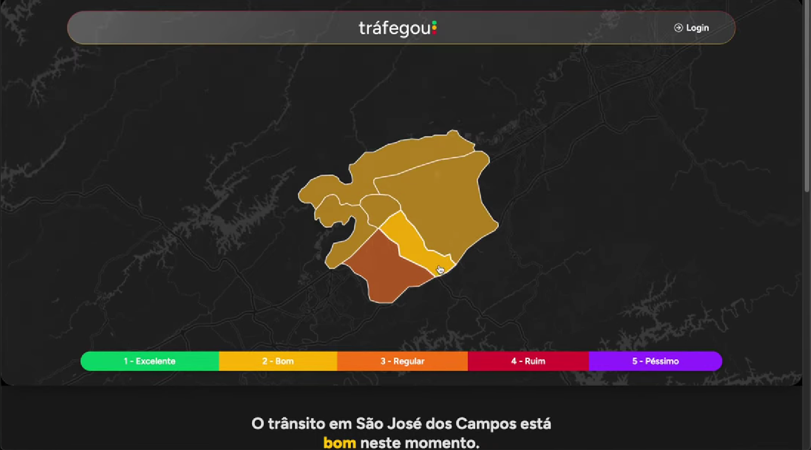
   
  

    
  

  
Detalhes do Projeto

  

    
  

  

    No segundo semestre de 2025, desenvolvemos o projeto <b>Tráfegou - Monitoramento de Tráfego Inteligente</b>, uma aplicação web criada para apoiar o monitoramento contínuo da mobilidade urbana. O sistema foi pensado para consolidar indicadores de tráfego por região, atribuir níveis de monitoramento, gerar alertas automáticos e registrar protocolos de ação para apoio à tomada de decisão.
  

  

    A solução foi construída com arquitetura full stack, utilizando <b>Vue.js 3 com TypeScript</b> no frontend, <b>Spring Boot com Java 17</b> no backend e integração com banco de dados relacional. Além disso, o projeto também contou com mapas interativos, dashboards, autenticação e processamento contínuo de dados.
  

  

    Atuei como <b>desenvolvedor full stack</b>, contribuindo tanto na construção de telas e fluxos do frontend quanto na implementação de autenticação, segurança, controllers, integrações e persistência no backend. Minha participação se concentrou principalmente em autenticação de usuários, dashboard administrativo, CRUD de usuários e cargos, configuração de segurança da API, ingestão e tratamento de dados e integração entre as camadas do sistema.
  

  

    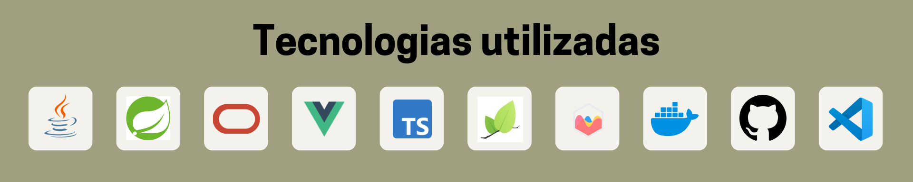
  

  

    
  

   

  

    
🛠️ Implementação da autenticação e do fluxo de acesso

    

    

      Uma das minhas principais contribuições no projeto foi a implementação da autenticação e do fluxo de acesso ao sistema. No frontend, atuei na criação da página de login, na lógica de autenticação e no fluxo de logout.
    

    

      No backend, trabalhei na configuração da autenticação, na proteção dos endpoints e na resolução de conflitos relacionados ao acesso. Esse trabalho foi importante para garantir que apenas usuários autorizados alcançassem as áreas administrativas da aplicação.
    

  
<b>Trecho do código (LoginScript.ts):</b>

    
    <pre><code class="language-ts">export function useLogin() {
      const nome = ref('');
      const senha = ref('');
      const erro = ref('');
      const store = usuarioStore();
      const router = useRouter();

      async function onSubmit(e: Event) {
        e.preventDefault();
        erro.value = ''; // limpa mensagem antes de tentar login
        try {
          await store.login(nome.value, senha.value);
          if (store.token) {
            router.push('/admin');
          } else {
            erro.value = 'Usuário ou senha inválidos';
          }
        } catch {
          erro.value = 'Usuário ou senha inválidos';
        }
      }

      return { nome, senha, erro, onSubmit };
    }</code></pre>

  
<b>Trecho do código (SecurityConfig.java):</b>

    
    <pre><code class="language-java">@Configuration
      @EnableMethodSecurity
      public class SecurityConfig {
          private final JwtAuthFilter jwtFilter;

          @Bean
          public SecurityFilterChain securityFilterChain(HttpSecurity http, JwtAuthFilter jwt) throws Exception {
              return http
                      .csrf(csrf -&gt; csrf.disable())
                      .sessionManagement(sm -&gt; sm.sessionCreationPolicy(SessionCreationPolicy.STATELESS))
                      .authorizeHttpRequests(auth -&gt; auth
                              .requestMatchers("/auth/**", "/error").permitAll()
                              .requestMatchers("/admin/**").hasRole("ADMIN")
                              .anyRequest().permitAll()
                      )
                      .addFilterBefore(jwt, UsernamePasswordAuthenticationFilter.class)
                      .build();
          }

          @Bean
          public PasswordEncoder passwordEncoder() {
              return new BCryptPasswordEncoder();
          }
      }</code></pre>

  

    
<b>Exemplo visual:</b>

    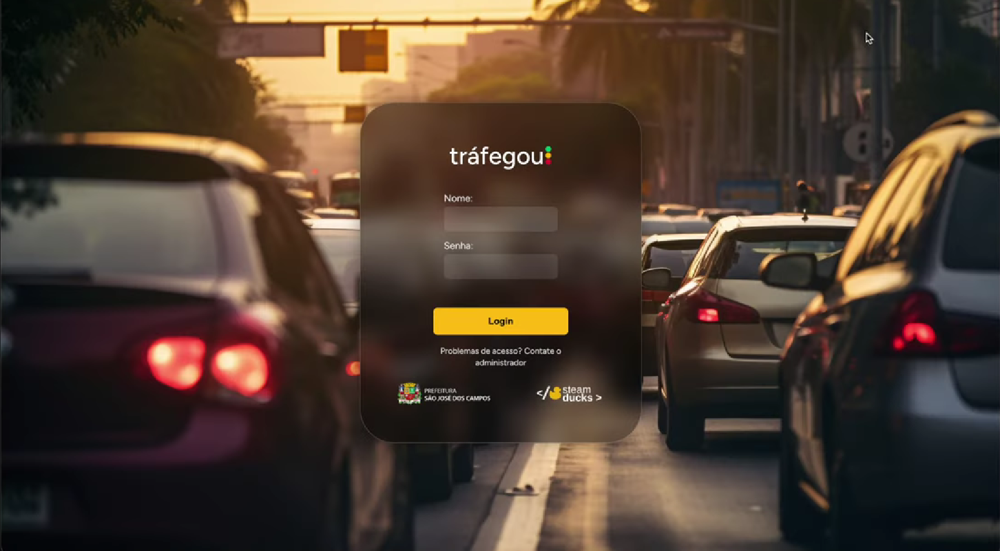
  

  

   

  

    
🛠️ Criação do dashboard administrativo e gerenciamento de usuários e cargos

    

    

      Também atuei no desenvolvimento da área administrativa do sistema. No frontend, contribuí com a criação da página de administração, a configuração do grid do dashboard e o desenvolvimento de componentes ligados à gestão de usuários, cargos e mensagens.
    

    

      No backend, essa entrega foi complementada pela criação de recursos para listagem, edição e organização de usuários e papéis, incluindo validações de dados e tratamento de conflitos de cadastro.
    

    
<b>Trecho do código (UserFormComponent.vue):</b>

    
    <pre><code class="language-ts">async function onSubmit() {
      try {
        loading.value = true;
        error.value = null;

        if (!form.username || !form.email) {
          throw new Error('Preencha nome e email.');
        }
        if (props.mode === 'create' &amp;&amp; (!form.password || form.password.length &lt; 6)) {
          throw new Error('Senha precisa ter ao menos 6 caracteres.');
        }

        let saved: User;

        if (props.mode === 'create') {
          const payload: UserPayload = {
            username: form.username,
            email: form.email,
            phoneNumber: form.phoneNumber.replace(/\D/g, ''),
            password: form.password,
            roleId: form.roleId,
          };
          saved = await UserService.register(payload);
          successMsg.value = 'Usuário cadastrado com sucesso!';
        } else {
          saved = await UserService.update(props.userId!, {
            username: form.username,
            email: form.email,
            phoneNumber: form.phoneNumber.replace(/\D/g, ''),
            password: form.password,
            roleId: form.roleId,
          });
        }
        emit('success', saved);
      } catch (e: unknown) {
        error.value = (e as Error).message || 'Erro na operação';
      } finally {
        loading.value = false;
      }
    }</code></pre>

  
<b>Trecho do código (UserService.java):</b>

  
    <pre><code class="language-java">public ManagerResponseDTO createUser(ManagerRequestDTO requestDTO) {
      Role adminRole = roleRepository.findByDescription(ADMIN_ROLE_DESCRIPTION)
              .orElseThrow(() -&gt; new ResponseStatusException(HttpStatus.INTERNAL_SERVER_ERROR,
              "Role não encontrado."));

      if (userRepository.existsByUsername(requestDTO.getUsername())) {
          throw new ResponseStatusException(HttpStatus.CONFLICT, "Username já existe.");
      }

      String normalizedPhone = requestDTO.getPhoneNumber().replaceAll("\\D", "");
      if (normalizedPhone.length() != 11) {
          throw new ResponseStatusException(HttpStatus.BAD_REQUEST,
          "Número de telefone inválido (esperado 11 dígitos)");
      }

      User newUser = new User();
      newUser.setUsername(requestDTO.getUsername());
      newUser.setEmail(requestDTO.getEmail());
      newUser.setPassword(passwordEncoder.encode(requestDTO.getPassword()));
      newUser.setPhoneNumber(normalizedPhone);
      newUser.setEnabled(true);
      newUser.setRole(adminRole);

      User savedUser = userRepository.save(newUser);
      return convertToResponseDTO(savedUser);
    }</code></pre>

  

    
<b>Exemplo visual:</b>

    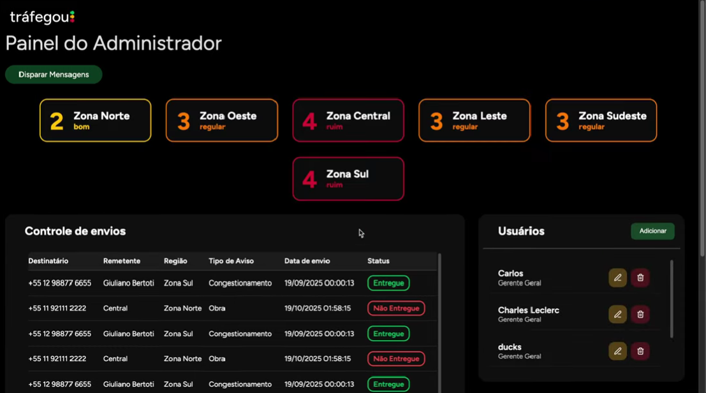
  

  

   

  

    
🛠️ Integração full stack para indicadores de tráfego

    

    

      Outra contribuição importante foi a integração entre frontend e backend para o consumo e a apresentação dos indicadores de tráfego. No frontend, trabalhei com os serviços responsáveis por buscar os níveis das zonas monitoradas e ajustar a interface para refletir corretamente os dados processados.
    

    

      No backend, contribuí com a configuração dos endpoints e com a lógica de cálculo e persistência dos indicadores regionais, incluindo o cruzamento entre dados de câmeras, regiões e condições climáticas.
    

    
<b>Trecho do código (IndicatorService.ts):</b>

    
    <pre><code class="language-ts">export interface HourlyIndicator {
      hour: number
      regionName: string
      indicatorName: string
      averageValue: number
    }

    class IndicatorService {
      async getHourlyIndicators(): Promise&lt;HourlyIndicator[]&gt; {
        const response = await axios.get&lt;{ hourly: HourlyIndicator[] }&gt;(
          'http://localhost:8080/indicators/hourly'
        )
        return response.data.hourly
      }

      async getDailyIndicators(): Promise&lt;DailyIndicator[]&gt; {
        const response = await axios.get&lt;{ daily: (Omit&lt;DailyIndicator, 'day'&gt; &amp; { day: string })[] }&gt;(
          'http://localhost:8080/indicators/daily'
        )
        return response.data.daily.map((item) =&gt; ({
          ...item,
          day: new Date(item.day),
        }))
      }

      async getIndicatorsStatus() {
        try {
          return (await axios.get('http://localhost:8080/indicators/status')).data
        } catch (ex) {
          console.error('Erro ao buscar status: ', ex)
        }
      }
    }</code></pre>

  
<b>Trecho do código (LevelService.java):</b>

    
    <pre><code class="language-java">public List&lt;ZoneLevelDTO&gt; getLatestRegionLevels() {
      List&lt;Level&gt; latestLevels = levelRepository.findTop6ByOrderByTimeDesc();

      return latestLevels.stream().map(level -&gt; {
          Integer regionId = level.getRegion().getIdRegion();
          String regionName = regionRepository.findById(regionId)
                  .map(Region::getName)
                  .orElse("Região Desconhecida");

          Integer latestWeatherCode = getLatestWeatherCodeForRegion(regionId);
          List&lt;Object[]&gt; cameraData = cameraRepository.findCamerasWithStatsForRegion(regionId);

          List&lt;Map&lt;String, Object&gt;&gt; cameras = cameraData.stream()
                  .map(row -&gt; {
                      Map&lt;String, Object&gt; cameraMap = new HashMap&lt;&gt;();
                      Double avgSpeed = ((Number) row[5]).doubleValue();

                      cameraMap.put("id", row[0].toString());
                      cameraMap.put("latitude", row[1]);
                      cameraMap.put("longitude", row[2]);
                      cameraMap.put("address", row[3]);
                      cameraMap.put("averageSpeed", Math.round(avgSpeed * 100.0) / 100.0);

                      return cameraMap;
                  }).collect(Collectors.toList());

          return new ZoneLevelDTO(String.valueOf(regionId), regionName, level.getValue(), cameras, latestWeatherCode);
      }).collect(Collectors.toList());
  }</code></pre>

  

    
<b>Exemplo visual:</b>

    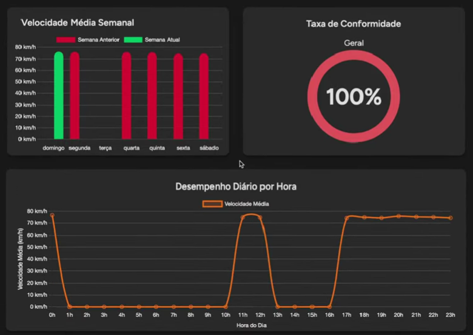
  

  

   

  

    
🛠️ Persistência, tratamento e otimização de dados

    

    

      Também contribuí com partes relacionadas à persistência e ao tratamento dos dados recebidos pelo sistema. Entre essas entregas estiveram o salvamento dos registros, o suporte à atualização periódica dos dados, a organização das tabelas e ajustes nas estruturas usadas pelos indicadores e alertas.
    

    

      A rotina de importação foi configurada para ser executada de forma agendada, processando os registros de velocidade, recalculando os indicadores regionais e persistindo os níveis de cada região. Esse fluxo garantiu que os dashboards apresentassem sempre informações atualizadas.
    

    
<b>Trecho do código (SpeedDataImportJob.java):</b>

    <pre><code class="language-java">@Component
      public class SpeedDataImportJob {

          private final SpeedRecordService speedRecordService;
          private final RegionIndicatorService regionIndicatorService;
          private final LevelService levelService;

          @Value("${server.role:MAIN}")
          private String serverRole;

          // Executa a cada 2 minutos para importar, processar e persistir dados
          @Scheduled(cron = "0 */2 * * * ?")
          public void execute() {
              if (!"MAIN".equalsIgnoreCase(serverRole)) {
                  return;
              }

              System.out.println("Inicializado importação de registros!");

              // Busca e substitui registros de velocidade
              speedRecordService.fetchAndReplaceSpeedRecords();

              // Calcula indicadores regionais
              regionIndicatorService.calculateAndSaveRegionIndicators();

              // Calcula e persiste níveis por região
              levelService.calculateLevelsForAllRegions();

              System.out.println("Finalizado importação de registros!");
          }
  }</code></pre>
  
<b>Trecho do código (Indicator.java e Level.java):</b>

    <pre><code class="language-java">@Entity
      @Table(name = "indicator")
      public class Indicator {
          @Id
          @GeneratedValue(strategy = GenerationType.IDENTITY)
          @Column(name = "id_indicator")
          private Integer idIndicator;

          @Column(name = "name", unique = true, nullable = false)
          private String name;

          @OneToMany(mappedBy = "indicator", cascade = CascadeType.ALL, orphanRemoval = true)
          private List&lt;RegionIndicator&gt; regionIndicators = new ArrayList&lt;&gt;();

          @OneToMany(mappedBy = "indicator", cascade = CascadeType.ALL, orphanRemoval = true)
          private List&lt;Protocol&gt; protocols = new ArrayList&lt;&gt;();

          // getters e setters...
      }

      @Entity
      @Table(name = "app_level")
      public class Level {
          @Id
          @GeneratedValue(strategy = GenerationType.IDENTITY)
          @Column(name = "id_level")
          private Integer idLevel;

          @Column(name = "value")
          private Integer value;

          @Column(name = "time")
          private OffsetDateTime time;

          @ManyToOne
          @JoinColumn(name = "id_region", nullable = false)
          private Region region;

          public Level() {}

          public Level(Integer value, OffsetDateTime time, Region region) {
              this.value = value;
              this.time = time;
              this.region = region;
          }

          // getters e setters...
  }</code></pre>
  

   
    

    
  

  <h2> 💻 Hard Skills </h2>

  

    
🛠️ Desenvolvimento Full Stack

    

    

      O Tráfegou foi um dos projetos em que mais ampliei minha experiência como desenvolvedor <strong>full stack</strong>. Diferentemente dos projetos anteriores, em que minha atuação estava mais concentrada em partes específicas da aplicação, neste projeto trabalhei tanto no frontend quanto no backend, precisando compreender como as diferentes camadas se conectavam para entregar uma funcionalidade completa.
    

    

      No frontend, trabalhei com <strong>Vue.js 3 e TypeScript</strong>, enquanto no backend utilizei <strong>Java 17 e Spring Boot</strong>. Essa combinação me obrigou a pensar além da implementação de uma tela ou de um endpoint isolado. Era necessário entender o fluxo completo dos dados, desde a interação do usuário até o processamento da informação no backend e sua persistência.
    

    

      Essa experiência consolidou uma visão mais prática de arquitetura full stack. Passei a compreender melhor a responsabilidade de cada camada e a importância de manter uma comunicação consistente entre interface, serviços, regras de negócio e banco de dados.
    

  

   

  

    
🛠️ Segurança, autenticação e autorização

    

    

      A implementação do fluxo de autenticação foi também um avanço importante na minha experiência técnica. Trabalhei desde a criação da tela de login e do fluxo de logout no frontend até a configuração da segurança da API no backend, incluindo autenticação baseada em <strong>JWT</strong>, proteção de endpoints e controle de acesso por perfil.
    

    

      Esse processo me fez compreender que autenticação não se resume a verificar usuário e senha. Uma aplicação precisa controlar o ciclo completo de acesso: identificar o usuário, manter sua sessão de forma adequada, proteger recursos e garantir que determinadas operações estejam disponíveis apenas para os perfis autorizados.
    

    

      Também tive contato com conceitos como <strong>BCrypt, filtros de autenticação, permissões por role e respostas HTTP relacionadas a acesso</strong>. Essa experiência foi importante para começar a tratar segurança como uma parte estrutural da aplicação, e não como uma funcionalidade adicional implementada depois.
    

  

   

  

    
🛠️ APIs REST e integração entre camadas

    

    

      O projeto aprofundou minha experiência com <strong>APIs REST</strong> e com a integração entre diferentes componentes de uma aplicação. Ao desenvolver serviços no frontend e endpoints no backend, precisei garantir que os dados fossem enviados, processados e retornados no formato esperado por cada camada.
    

    

      Trabalhar com indicadores de tráfego foi especialmente importante nesse sentido. Os dados precisavam passar por diferentes etapas de processamento antes de serem apresentados na interface, e o frontend precisava interpretar corretamente essas informações para alimentar dashboards, indicadores e outras visualizações.
    

    

      Essa experiência me ajudou a compreender melhor conceitos como <strong>contratos de API, DTOs, tratamento de respostas, serialização de dados e separação entre responsabilidades</strong>. Também desenvolvi uma maior atenção aos efeitos que uma alteração em um endpoint pode causar nas demais camadas do sistema.
    

  

   

  

    
🛠️ Processamento e automação de dados

    

    

      Outra evolução importante foi o contato com fluxos de <strong>processamento automatizado de dados</strong>. O Tráfegou precisava receber registros de velocidade, processar essas informações, calcular indicadores regionais e atualizar os níveis de cada região de forma periódica.
    

    

      Trabalhar com uma rotina agendada me fez pensar na aplicação para além das ações realizadas diretamente pelo usuário. O sistema também precisava executar processos em segundo plano, respeitando uma sequência de operações e garantindo que os dados utilizados pelos dashboards permanecessem atualizados.
    

    

      Esse aprendizado ampliou minha compreensão sobre sistemas que dependem de <strong>pipelines de processamento, tarefas agendadas e persistência contínua</strong>. Passei a perceber melhor como aplicações podem combinar interações em tempo real com processos automatizados responsáveis por manter o estado do sistema atualizado.
    

  

   

  

    
🛠️ Persistência e tratamento de dados

    

    

      O projeto também aprofundou meu contato com a camada de persistência. Trabalhei com entidades, relacionamentos e consultas responsáveis por recuperar informações de regiões, câmeras, indicadores e níveis de tráfego.
    

    

      Um dos principais aprendizados foi entender que os dados apresentados na interface nem sempre existem no banco exatamente na forma em que o usuário precisa visualizá-los. Em alguns casos, foi necessário combinar informações de diferentes fontes, realizar cálculos e transformar os resultados antes de retorná-los para o frontend.
    

    

      Essa experiência fortaleceu minha capacidade de trabalhar com <strong>dados como parte de uma regra de negócio</strong>, e não apenas como registros armazenados. Passei a considerar mais cuidadosamente como as informações são persistidas, recuperadas, transformadas e finalmente utilizadas pela aplicação.
    

  

  <h2> 🤝 Soft Skills </h2>

  

    
🌱 Visão sistêmica

    

    

      A principal habilidade desenvolvida neste projeto foi minha <strong>visão sistêmica</strong>. Trabalhar simultaneamente com frontend, backend, autenticação, banco de dados e processamento de informações tornou mais evidente que uma aplicação não pode ser analisada apenas por suas funcionalidades isoladas.
    

    

      Uma alteração na autenticação poderia afetar o acesso às telas; uma mudança na API poderia exigir ajustes nos serviços do frontend; uma alteração na estrutura dos dados poderia modificar a forma como os indicadores eram apresentados. Passei a considerar com mais frequência essas dependências antes de implementar ou alterar uma funcionalidade.
    

    

      Essa visão foi importante para minha evolução porque comecei a pensar menos em "qual código preciso escrever?" e mais em <strong>"qual é o fluxo completo que precisa funcionar?"</strong>.
    

  

   

  

    
🌱 Resolução de problemas

    

    

      O nível de complexidade do Tráfegou também exigiu uma evolução na minha capacidade de <strong>investigar e resolver problemas</strong>. Diferentes problemas poderiam estar relacionados ao frontend, ao backend, à autenticação, aos dados ou à comunicação entre essas camadas, o que exigia uma investigação mais estruturada.
    

    

      Em vez de considerar apenas o ponto em que um erro aparecia, comecei a analisar o caminho percorrido pela informação para identificar onde o comportamento esperado havia sido interrompido. Essa forma de investigação foi especialmente importante nos problemas relacionados à autenticação e à integração dos indicadores.
    

    

      Essa experiência contribuiu para desenvolver uma postura mais analítica diante de problemas técnicos e para trabalhar com mais autonomia quando uma solução não era imediatamente evidente.
    

  

   

  

    
🌱 Colaboração técnica

    

    

      Como o projeto envolvia diferentes áreas da aplicação, a colaboração técnica se tornou ainda mais importante. Meu trabalho dependia de interfaces bem definidas entre as partes do sistema e, em diferentes momentos, precisei alinhar comportamento de endpoints, estruturas de dados e funcionamento das telas com outros integrantes.
    

    

      Também tive oportunidades de auxiliar colegas em questões técnicas e discutir alternativas para implementação. Isso me ajudou a perceber que colaboração em desenvolvimento não significa apenas dividir tarefas, mas também <strong>compartilhar contexto e conhecimento para reduzir bloqueios e manter o sistema integrado</strong>.
    

  

   

  

    
🌱 Autonomia e responsabilidade técnica

    

    

      A quantidade de responsabilidades técnicas que assumi neste projeto também exigiu mais <strong>autonomia</strong>. Em diferentes momentos, precisei investigar problemas, entender partes do sistema com as quais ainda não tinha familiaridade e buscar uma solução que pudesse ser integrada ao trabalho do restante da equipe.
    

    

      Essa experiência mudou um pouco minha relação com as tarefas técnicas. Em projetos anteriores, eu ainda estava muito concentrado em aprender a implementar aquilo que havia sido definido. No Tráfegou, comecei a assumir mais responsabilidade pelo resultado da funcionalidade e pelo impacto que minha implementação teria nas outras partes da aplicação.
    

    

      Foi um passo importante para desenvolver uma postura mais próxima da realidade profissional, em que nem sempre existe uma solução pronta e o desenvolvedor precisa ter autonomia para <strong>investigar, tomar decisões técnicas e assumir responsabilidade pela entrega</strong>.
    

  

  <h2> 📚 Competências desenvolvidas </h2>

  <h3>💻 Competências técnicas</h3>

  <table>
    <thead>
      <tr><th>Competência</th><th>Nível</th></tr>
    </thead>
    <tbody>
      <tr><td>Vue.js 3</td><td>intermediário</td></tr>
      <tr><td>TypeScript</td><td>intermediário</td></tr>
      <tr><td>Java 17</td><td>intermediário</td></tr>
      <tr><td>Spring Boot</td><td>intermediário</td></tr>
      <tr><td>Desenvolvimento Full Stack</td><td>intermediário</td></tr>
      <tr><td>APIs REST</td><td>intermediário</td></tr>
      <tr><td>Integração frontend/backend</td><td>intermediário</td></tr>
      <tr><td>JWT</td><td>básico/intermediário</td></tr>
      <tr><td>Spring Security</td><td>básico/intermediário</td></tr>
      <tr><td>Autenticação e autorização</td><td>básico/intermediário</td></tr>
      <tr><td>PostgreSQL e persistência de dados</td><td>intermediário</td></tr>
      <tr><td>JPA / Hibernate</td><td>básico/intermediário</td></tr>
      <tr><td>Processamento e transformação de dados</td><td>intermediário</td></tr>
      <tr><td>Rotinas agendadas e automação</td><td>básico/intermediário</td></tr>
      <tr><td>Git e GitHub</td><td>intermediário</td></tr>
    </tbody>
  </table>

  <h3>🤝 Soft Skills trabalhadas</h3>

  

    O quarto semestre representou uma evolução importante na minha experiência técnica. Depois de construir minha base de programação, experimentar o papel de Product Owner e desenvolver uma aplicação web full stack, no Tráfegou passei a trabalhar com problemas que exigiam uma compreensão mais profunda da relação entre diferentes camadas de um sistema.
  

  

    A principal evolução foi minha <strong>visão sistêmica</strong>. Trabalhar com frontend, backend, autenticação, banco de dados e processamento automatizado fez com que eu passasse a enxergar as funcionalidades como fluxos completos. Uma entrega precisava funcionar não apenas individualmente, mas também dentro da arquitetura e das dependências existentes.
  

  

    Também desenvolvi mais <strong>autonomia, capacidade de investigação e responsabilidade técnica</strong>. Os problemas encontrados nem sempre estavam concentrados na parte do código em que apareciam, exigindo que eu investigasse diferentes camadas e entendesse o comportamento do sistema antes de definir uma solução.
  

  

    Se os primeiros semestres foram importantes para construir minha base e experimentar diferentes papéis dentro de um time, o Tráfegou foi o momento em que comecei a consolidar uma atuação mais próxima de um <strong>desenvolvedor full stack</strong>. Passei a conectar desenvolvimento, arquitetura, segurança, dados e regras de negócio em uma mesma entrega, desenvolvendo uma visão mais completa sobre o processo de construção de software.
  

  

<!-- 5º Semestre -->

 <h1>5º Semestre • 1/2026</h1>

  <h3><a href="https://github.com/Steam-Ducks/strategic-cost-analytics" target="_blank">SCAR - Sistema de Controle e Autonomia de Recursos</a></h3>
  
<i>Solução analítica desenvolvida para a SIATT, com Data Warehouse que integra dados de ERP e PLM para consolidar custos de materiais e horas técnicas por projeto e programa, apoiando o acompanhamento orçamentário e a tomada de decisão.</i>

   
  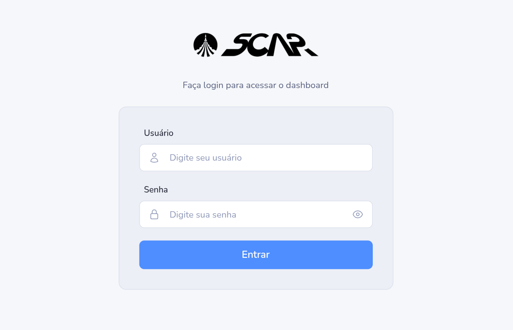
   
  

    
  

  
Detalhes do Projeto

  

    
  

  

    No primeiro semestre de 2026, desenvolvemos o <b>SCAR (Sistema de Controle e Autonomia de Recursos)</b>, uma solução analítica criada para a <b>SIATT</b>, empresa brasileira do setor de defesa especializada em sistemas de mísseis inteligentes, sistemas embarcados críticos e integração de alta tecnologia para aplicações militares. Por se tratar de um ambiente de alta segurança, o projeto exigiu atenção especial a controle de acesso, rastreabilidade e documentação formal das decisões técnicas.
  

  

    O problema apresentado pelo cliente era a fragmentação dos dados de compras, consumo de materiais, estoque, tarefas e horas trabalhadas entre o <b>ERP</b> e o <b>PLM</b>, o que impedia enxergar o custo real de cada projeto e programa. A proposta foi projetar e implementar um <b>Data Warehouse</b>, com modelagem dimensional em estrela/snowflake, capaz de consolidar materiais e horas técnicas em uma base histórica única, viabilizando análises multidimensionais, indicadores de saúde financeira e comparação entre custo real e budget. A solução foi construída com <b>Python e Django</b> no backend e <b>Vue.js com TypeScript</b> no frontend.
  

  

    Neste semestre também fomos orientados a incorporar práticas de <b>DevOps</b> ao projeto, distribuindo entre os integrantes as diferentes frentes da cultura DevOps. Fiquei responsável pela frente de <b>ReqTrack (rastreabilidade de requisitos)</b>, garantindo que cada requisito levantado com o cliente pudesse ser acompanhado até a entrega no repositório.
  

  

    Atuei como <b>Product Owner</b>, sendo responsável pela ponte entre o cliente e o time de desenvolvimento. Conduzi o levantamento de requisitos com o stakeholder, projetei a modelagem dimensional do Data Warehouse, especifiquei as telas e os perfis de acesso, escrevi todo o product backlog em epics e user stories com critérios de aceitação, DoR, DoD e casos de teste, quebrei as user stories em tasks por sprint, documentei os padrões de engenharia do projeto e estruturei a rastreabilidade de requisitos no Jira.
  

  

    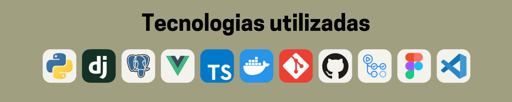
  

  

    
  

   

  

    
🛠️ Levantamento de requisitos e alinhamento com o cliente

    

    

      Minha primeira contribuição foi conduzir o levantamento de requisitos junto ao parceiro da SIATT, traduzindo um cenário de negócio complexo em um escopo viável para o semestre. Esse trabalho envolveu documentar o contexto da empresa, o problema estratégico da fragmentação de dados entre ERP e PLM e as perguntas de negócio que a solução precisava responder, como o custo consolidado por projeto, o desvio percentual em relação ao budget e quais projetos apresentavam risco de estouro.
    

    

      Também mantive um canal contínuo de perguntas ao cliente para eliminar ambiguidades antes do desenvolvimento, definindo pontos críticos como a fórmula oficial de "custo real", o menor nível de detalhe necessário nas análises, o tratamento de hierarquias entre programa e projeto e a política de moeda. Um momento importante dessa atuação foi negociar com o stakeholder a inclusão do tema de orçamento e saúde financeira apenas na segunda sprint, protegendo o ciclo de desenvolvimento que já estava em andamento sem perder uma necessidade relevante do negócio.
    

    
<b>Trecho da documentação (definições validadas com o cliente):</b>

  

    
<b>Exemplo visual:</b>

    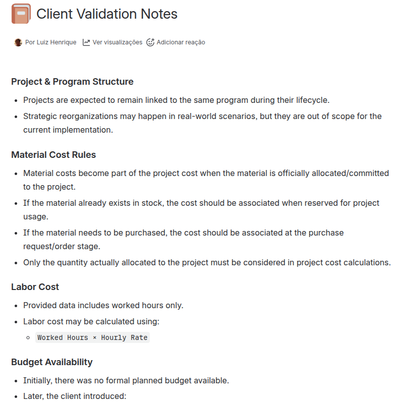
  

  

   

  

    
🛠️ Modelagem dimensional do Data Warehouse

    

    

      Fui responsável pelo desenho do modelo analítico do sistema, definindo as dimensões, as tabelas fato, o grão de cada fato e os relacionamentos entre elas. O modelo contemplou dimensões como programa, projeto, tempo, material, fornecedor, colaborador, tarefa, solicitação e pedido de compra, todas com surrogate key e chave natural para preservar a rastreabilidade até o sistema de origem.
    

    

      Além da estrutura, documentei as regras de negócio e de uso analítico de cada fato, deixando explícito quais tabelas compõem o custo consolidado e quais existem apenas para rastreabilidade operacional. Esse cuidado foi importante para evitar dupla contagem de valores nos indicadores e para que o time tivesse uma referência única sobre como cada número deveria ser calculado, incluindo a regra de classificação da saúde financeira dos projetos.
    

    

      
<b>Exemplo visual:</b>

      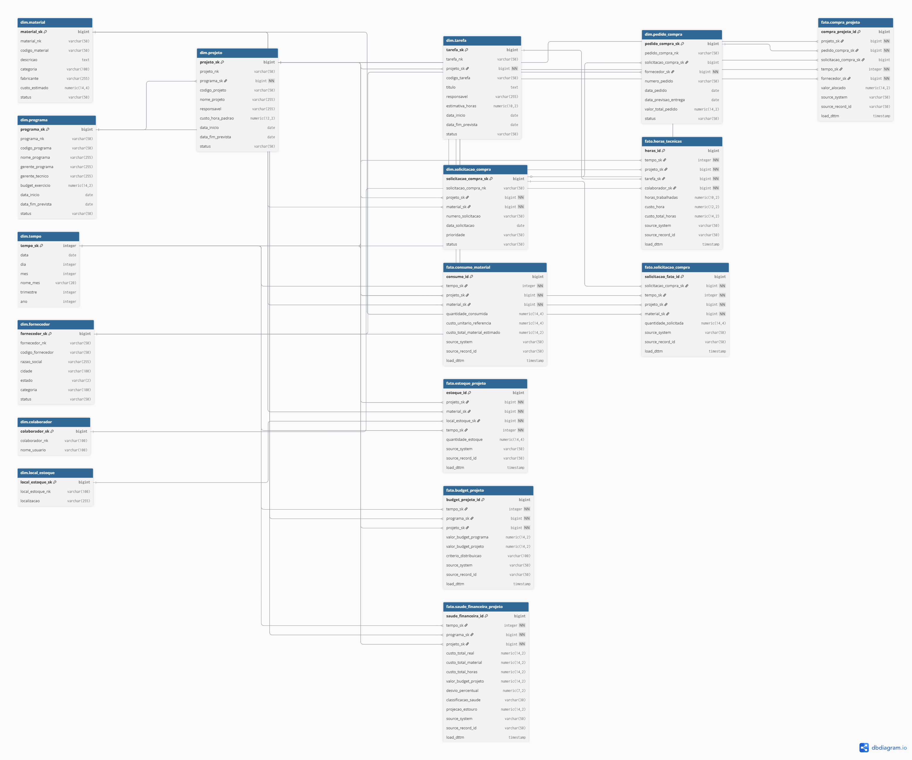
    

  

   

  

    
🛠️ Especificação de telas, wireframes e perfis de acesso

    

    

      Também fui responsável por especificar as telas da aplicação e entregar ao time a referência visual do produto. Para cada tela documentei o objetivo, os elementos esperados, os filtros disponíveis e, no caso dos dashboards, o detalhamento de cada gráfico: tipo de visualização, métrica exibida, comparação realizada e a pergunta de negócio que ele deveria responder.
    

    

      Outro ponto importante dessa entrega foi a definição da matriz de perfis de acesso. Como o sistema seria utilizado por áreas diferentes (Super Admin, Financeiro, Compras, Almoxarifado e Projetos), mapeei tela a tela o que cada perfil poderia visualizar e quais indicadores ficariam restritos. Esse recorte era especialmente sensível no contexto da SIATT, onde informação financeira consolidada e dados de projetos estratégicos não devem circular indistintamente.
    

    

    
<b>Trecho da especificação (Tela 2: Dashboard principal):</b>

      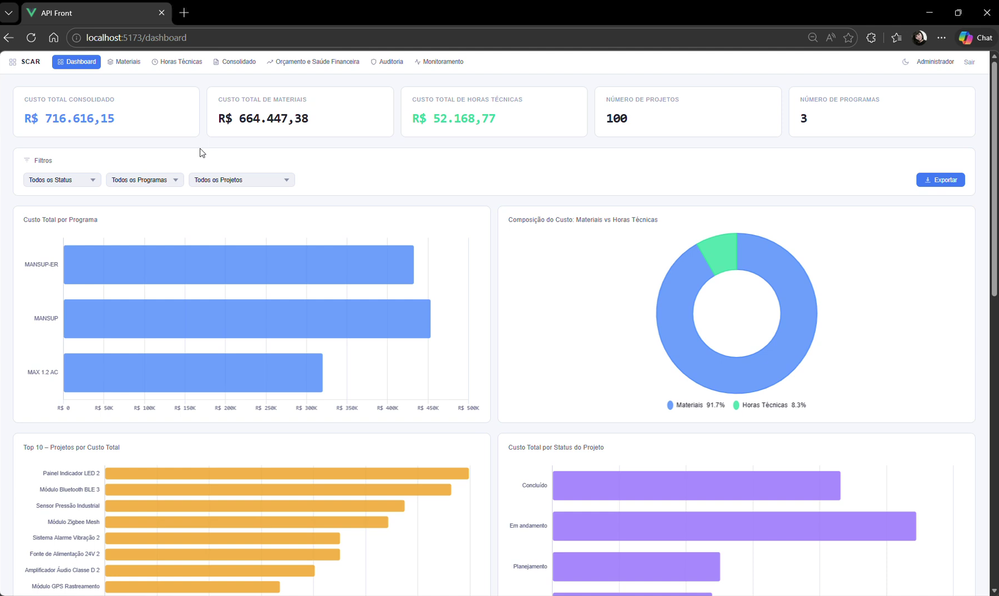
    

  

   

  

    
🛠️ Construção e gestão do product backlog

    

    

      Escrevi o product backlog completo do projeto, organizado em dez epics que cobriam desde acesso e controle até orçamento, saúde financeira e ingestão de dados. Cada user story foi documentada com descrição funcional, critérios de aceitação, Definition of Ready, Definition of Done, casos de teste e referência visual, de forma que o time pudesse iniciar o desenvolvimento sem depender de interpretação.
    

    

      Além da escrita das histórias, atuei na quebra das entregas em tasks por sprint e na distribuição delas entre os integrantes do time, acompanhando o que era necessário no backend, no frontend e na camada de dados para que cada história fosse concluída. Esse trabalho de decomposição ajudou a manter o ritmo das sprints previsível e a tornar visível a dependência entre as tarefas de ETL e as tarefas de interface.
    

    

      
<b>Trecho do backlog (User Story 01: Autenticar no sistema):</b>

      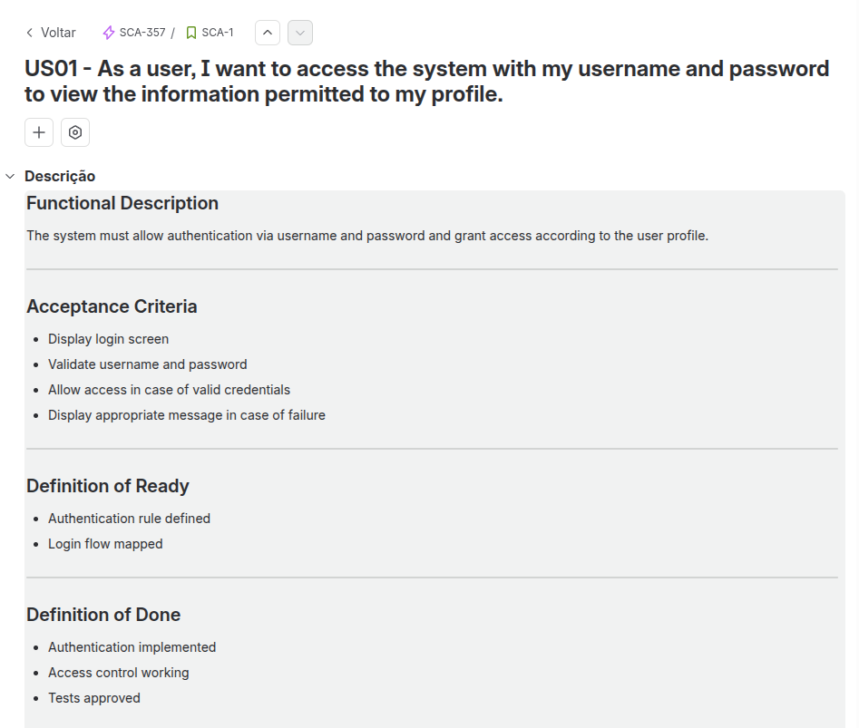
      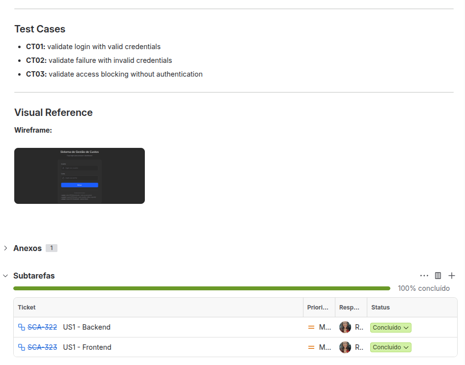
    

  

   

  

    
🛠️ DevOps: rastreabilidade de requisitos (ReqTrack) no Jira

    

    

      Neste semestre fomos orientados a aplicar práticas de DevOps ao projeto, e fiquei responsável pela frente de <b>ReqTrack</b>, ou seja, pela rastreabilidade dos requisitos. O objetivo era garantir que nenhum requisito levantado com o cliente se perdesse ao longo do desenvolvimento e que fosse sempre possível responder onde cada necessidade do negócio estava sendo atendida.
    

    

      Toda essa estrutura foi construída no <b>Jira</b>. Escrevi todos os requisitos do sistema e atribuí uma <b>tag</b> a cada um deles. Essa tag era referenciada pelos <b>Epics</b>, que por sua vez estavam conectados às <b>User Stories</b>, e cada user story se desdobrava nas <b>Tasks</b> executadas pelo time durante as sprints. Com isso, qualquer item do backlog podia ser percorrido em duas direções: do requisito até a task que o implementou, e da task de volta até a necessidade original do cliente.
    

    

      Por fim, conectamos o Jira ao repositório do projeto, o <a href="https://github.com/Steam-Ducks/strategic-cost-analytics" target="_blank">strategic-cost-analytics</a>, de forma que os commits e as branches ficassem vinculados às tasks correspondentes. Essa integração fechou o ciclo de rastreabilidade, ligando o requisito de negócio ao código efetivamente entregue.
    

    
<b>Cadeia de rastreabilidade adotada:</b>

    <pre><code>Requisito (com tag)
      └── Epic (referencia a tag do requisito)
              └── User Story (critérios de aceitação, DoR, DoD, casos de teste)
                      └── Task (executada na sprint)
                              └── Branch / commit no repositório GitHub
                                  Steam-Ducks/strategic-cost-analytics</code></pre>
    

      
<b>Exemplo Visual de Requisito Funcional:</b>

      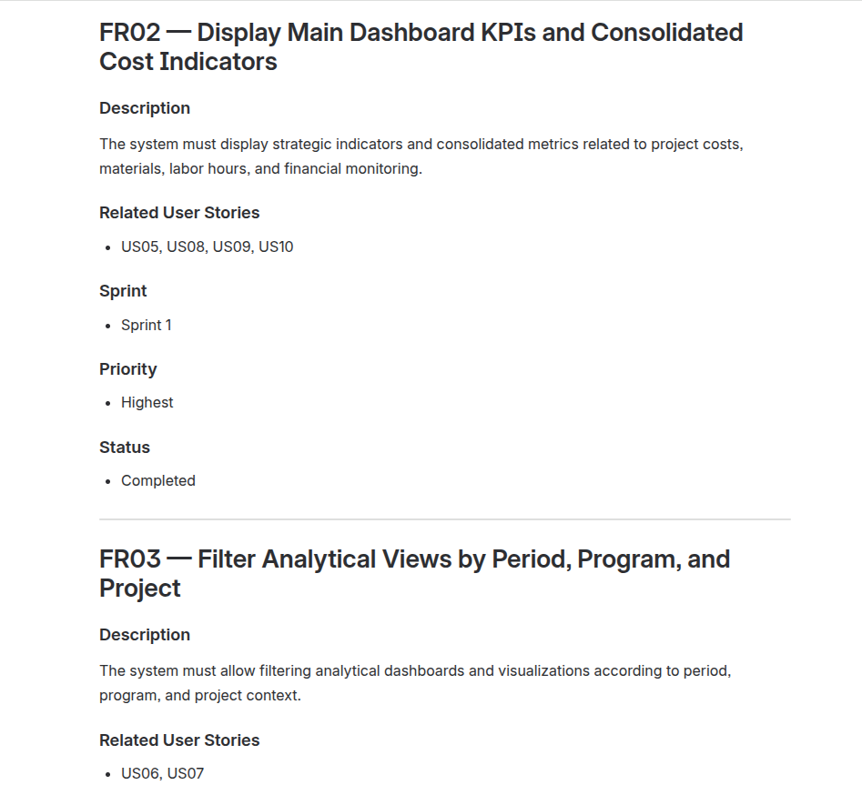
      
<b>Exemplo Visual de Epic, User Storie e Task:</b>

      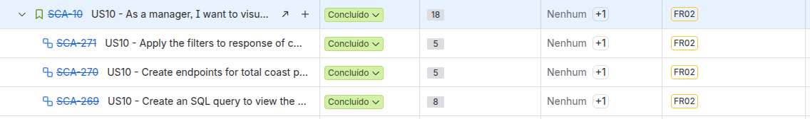
    

  

   
    

    
  

  <h2> 💻 Hard Skills </h2>

  

    
🛠️ Engenharia de requisitos e Product Ownership

    

    

      O SCAR representou uma evolução importante na minha experiência como <strong>Product Owner</strong>. Nos projetos anteriores, eu já havia tido contato com a organização de produto, documentação e acompanhamento de sprints. Neste semestre, porém, passei a lidar diretamente com um cliente e com um problema de negócio mais complexo, o que exigiu uma atuação mais estruturada na definição do produto.
    

    

      Precisei transformar conversas com o stakeholder em requisitos concretos, identificar ambiguidades, validar definições e estabelecer o que realmente precisava ser entregue dentro do semestre. Isso envolveu não apenas escrever histórias, mas compreender o problema antes de transformá-lo em especificação.
    

    

      A experiência aprofundou minha compreensão sobre <strong>engenharia de requisitos, priorização, critérios de aceitação e gestão de escopo</strong>. Também passei a entender melhor o Product Owner como alguém responsável por reduzir a distância entre a necessidade do negócio e aquilo que o time efetivamente consegue construir.
    

  

   

  

    
🛠️ Data Warehouse e modelagem dimensional

    

    

      O maior desafio técnico que assumi neste projeto foi a construção da visão analítica do <strong>Data Warehouse</strong>. O problema do cliente não era simplesmente armazenar dados, mas consolidar informações provenientes de sistemas diferentes para permitir análises confiáveis sobre custos, materiais, horas técnicas e orçamento.
    

    

      Para isso, precisei compreender conceitos de <strong>modelagem dimensional, tabelas fato, dimensões, grão, surrogate keys e chaves naturais</strong>. Mais importante do que conhecer esses conceitos individualmente foi entender como as decisões de modelagem afetavam diretamente os indicadores que seriam apresentados ao usuário.
    

    

      Um dos principais aprendizados foi perceber que a qualidade de um dashboard começa muito antes da camada visual. Se o grão de uma tabela estiver errado, se duas fontes forem somadas de maneira inadequada ou se uma regra de negócio não estiver bem definida, o indicador final pode parecer correto e ainda assim representar um número incorreto.
    

    

      Essa experiência mudou minha forma de pensar sobre dados. Passei a enxergar o Data Warehouse não apenas como uma estrutura de armazenamento, mas como uma <strong>camada de tradução entre os dados operacionais e as perguntas de negócio</strong> que a empresa precisa responder.
    

  

   

  

    
🛠️ Modelagem de regras de negócio e indicadores

    

    

      O SCAR também aprofundou minha experiência na transformação de conceitos de negócio em regras computáveis. Termos como <strong>custo real, budget, desvio percentual e saúde financeira</strong> precisavam deixar de ser apenas conceitos discutidos com o cliente e se tornar regras objetivas que pudessem ser implementadas e reproduzidas pelo sistema.
    

    

      Para isso, precisei validar com o stakeholder exatamente o que cada indicador deveria representar, qual fonte deveria ser utilizada e quais exceções deveriam ser consideradas. Esse processo mostrou que pequenas ambiguidades em uma definição de negócio podem gerar grandes diferenças na implementação.
    

    

      Desenvolvi, portanto, uma capacidade maior de <strong>questionar definições, identificar premissas e transformar conceitos abstratos em regras mensuráveis</strong>. Esse aprendizado foi especialmente relevante porque a solução tinha como objetivo apoiar decisões financeiras e, consequentemente, os números apresentados precisavam possuir uma definição clara e rastreável.
    

  

   

  

    
🛠️ Arquitetura analítica e integração de dados

    

    

      Trabalhar com dados provenientes de ERP e PLM também me aproximou de problemas de integração e consolidação de dados. Foi necessário pensar em como diferentes fontes poderiam alimentar uma estrutura analítica única sem perder a rastreabilidade da origem das informações.
    

    

      Nesse processo, tive contato com conceitos como <strong>staging, ETL/ELT, cargas incrementais e controle de execução</strong>. Passei a compreender melhor que um ambiente analítico depende de uma cadeia de processamento consistente para garantir que os dados apresentados ao usuário estejam atualizados, íntegros e relacionados corretamente às suas fontes.
    

    

      Esse conhecimento ampliou minha visão sobre sistemas orientados a dados e sobre a quantidade de decisões técnicas que existem entre o dado original e o indicador apresentado em um dashboard.
    

  

   

  

    
🛠️ Rastreabilidade de requisitos e DevOps

    

    

      Outra evolução importante foi meu contato com <strong>DevOps através da rastreabilidade de requisitos</strong>. Fiquei responsável pela frente de ReqTrack e precisei estruturar uma relação clara entre aquilo que havia sido solicitado pelo cliente e aquilo que efetivamente chegava ao código.
    

    

      A cadeia formada por requisito, epic, user story, task e branch ou commit me mostrou que rastreabilidade não é apenas uma atividade administrativa. Ela permite responder perguntas importantes sobre o desenvolvimento: de onde veio determinada funcionalidade, qual necessidade ela atende, quem trabalhou nela e onde essa implementação pode ser encontrada.
    

    

      Essa experiência também mudou minha percepção sobre DevOps. Passei a enxergar a disciplina de forma mais ampla, não apenas como infraestrutura ou deploy, mas como um conjunto de práticas que ajudam a conectar <strong>planejamento, desenvolvimento, qualidade, rastreabilidade e entrega</strong>.
    

  

   

  

    
🛠️ Padronização e documentação de engenharia

    

    

      A necessidade de documentar os padrões de engenharia do projeto também me fez compreender melhor o papel da <strong>padronização técnica</strong>. Definir estratégias de dados, testes, branches, commits, integração contínua e análise estática ajudou a estabelecer uma referência comum para o time.
    

    

      Esse aprendizado foi importante porque comecei a perceber que boas práticas de engenharia não funcionam apenas quando cada desenvolvedor conhece determinada técnica. Elas precisam ser transformadas em acordos e padrões que possam ser consultados e aplicados de maneira consistente por todo o time.
    

    

      Como resultado, desenvolvi uma visão mais madura sobre <strong>governança técnica, documentação e qualidade de desenvolvimento</strong>, entendendo que esses elementos também fazem parte da construção de um produto sustentável.
    

  

  <h2> 🤝 Soft Skills </h2>

  

    
🌱 Comunicação com stakeholders

    

    

      A comunicação com o cliente foi uma das habilidades mais desenvolvidas neste semestre. Diferentemente de simplesmente receber requisitos prontos, precisei conduzir conversas para descobrir informações que ainda não estavam claras e validar se a interpretação do time correspondia à necessidade real do negócio.
    

    

      Aprendi a formular perguntas mais específicas, apresentar alternativas e explicar as consequências de determinadas decisões. Em vez de tratar uma dúvida como um bloqueio, comecei a utilizá-la como uma oportunidade para eliminar uma ambiguidade antes que ela chegasse ao desenvolvimento.
    

    

      Essa experiência foi importante para desenvolver uma comunicação mais <strong>estruturada, objetiva e orientada à decisão</strong>, principalmente em situações nas quais o cliente e o time técnico possuem perspectivas diferentes sobre o mesmo problema.
    

  

   

  

    
🌱 Negociação e gestão de escopo

    

    

      Uma das habilidades que mais evoluiu foi minha capacidade de lidar com <strong>escopo e prioridades</strong>. Durante o projeto, surgiram necessidades relevantes que não poderiam simplesmente ser ignoradas, mas que também não poderiam interromper uma sprint que já estava em andamento.
    

    

      A decisão de levar orçamento e saúde financeira para a sprint seguinte foi um exemplo prático desse equilíbrio. Foi necessário reconhecer a importância da demanda, explicar o impacto de introduzi-la naquele momento e encontrar uma alternativa que preservasse tanto a necessidade do cliente quanto o planejamento do time.
    

    

      Essa situação me ajudou a entender que priorização não significa simplesmente decidir o que é importante e o que não é. Muitas vezes significa <strong>decidir quando algo deve acontecer</strong> para maximizar o valor da entrega sem comprometer aquilo que já está em andamento.
    

  

   

  

    
🌱 Pensamento analítico e tomada de decisão

    

    

      O nível de complexidade do problema também exigiu uma evolução na minha capacidade de analisar situações antes de tomar decisões. O SCAR envolvia diferentes fontes de dados, regras financeiras, perfis de acesso, requisitos e limitações de tempo, então uma decisão aparentemente simples poderia afetar várias partes do produto.
    

    

      Passei a trabalhar mais frequentemente decompondo problemas, identificando dependências e buscando informações antes de definir uma solução. Isso foi especialmente importante na modelagem do Data Warehouse, em que uma decisão sobre estrutura poderia influenciar diretamente os cálculos e indicadores utilizados posteriormente.
    

    

      Essa experiência fortaleceu minha capacidade de <strong>analisar problemas de diferentes perspectivas e tomar decisões considerando seus impactos</strong>, em vez de olhar apenas para a consequência imediata de uma escolha.
    

  

   

  

    
🌱 Liderança e coordenação

    

    

      Como Product Owner, também precisei assumir uma posição de coordenação dentro do time. A responsabilidade pelo backlog, pela quebra das histórias em tasks e pelo acompanhamento das dependências entre as diferentes frentes exigiu que eu mantivesse uma visão geral do trabalho sem perder os detalhes necessários para orientar cada entrega.
    

    

      Essa experiência desenvolveu uma forma diferente de liderança. Não se tratava de distribuir ordens, mas de <strong>criar clareza para que o time pudesse trabalhar</strong>. Uma história bem definida, um critério de aceitação claro ou uma dependência identificada antecipadamente poderiam evitar bloqueios e reduzir retrabalho.
    

    

      Foi uma evolução importante em relação às experiências anteriores, porque comecei a entender liderança também como a capacidade de organizar contexto, remover ambiguidades e criar condições para que outras pessoas consigam executar bem seu trabalho.
    

  

   

  

    
🌱 Visão de negócio e visão técnica

    

    

      Talvez o principal aprendizado deste semestre tenha sido conseguir aproximar duas perspectivas que até então eu vinha desenvolvendo separadamente: <strong>produto e tecnologia</strong>.
    

    

      Como Product Owner, precisei entender a dor do cliente e transformar essa necessidade em requisitos. Ao mesmo tempo, precisei compreender modelagem dimensional, regras de cálculo, arquitetura de dados e padrões de engenharia para garantir que aquilo que estava sendo especificado fosse tecnicamente viável.
    

    

      Essa combinação me ajudou a desenvolver uma visão mais completa sobre projetos de software. Comecei a perceber que uma boa solução depende tanto de entender corretamente <strong>o problema que precisa ser resolvido</strong> quanto de compreender <strong>as limitações e possibilidades da tecnologia utilizada para resolvê-lo</strong>.
    

  

  <h2> 📚 Competências desenvolvidas </h2>

  <h3>💻 Competências técnicas</h3>

  <table>
    <thead>
      <tr><th>Competência</th><th>Nível</th></tr>
    </thead>
    <tbody>
      <tr><td>Product Owner</td><td>avançado</td></tr>
      <tr><td>Engenharia de requisitos</td><td>avançado</td></tr>
      <tr><td>Product Backlog e User Stories</td><td>avançado</td></tr>
      <tr><td>Critérios de aceitação, DoR e DoD</td><td>avançado</td></tr>
      <tr><td>Data Warehouse</td><td>intermediário/avançado</td></tr>
      <tr><td>Modelagem dimensional</td><td>intermediário/avançado</td></tr>
      <tr><td>Modelagem Star Schema / Snowflake</td><td>intermediário</td></tr>
      <tr><td>ETL / ELT</td><td>intermediário</td></tr>
      <tr><td>PostgreSQL</td><td>intermediário</td></tr>
      <tr><td>Python</td><td>intermediário</td></tr>
      <tr><td>Django</td><td>intermediário</td></tr>
      <tr><td>Vue.js</td><td>intermediário</td></tr>
      <tr><td>TypeScript</td><td>intermediário</td></tr>
      <tr><td>Dashboards e indicadores de negócio</td><td>intermediário/avançado</td></tr>
      <tr><td>Jira</td><td>avançado</td></tr>
      <tr><td>Rastreabilidade de requisitos</td><td>avançado</td></tr>
      <tr><td>Git e GitHub</td><td>avançado</td></tr>
      <tr><td>GitHub Actions</td><td>básico/intermediário</td></tr>
      <tr><td>Testes e qualidade de software</td><td>básico/intermediário</td></tr>
      <tr><td>Análise estática de código</td><td>básico/intermediário</td></tr>
    </tbody>
  </table>

  <h3>🤝 Soft Skills trabalhadas</h3>
  

    O quinto semestre representa um ponto importante na minha formação porque foi o momento em que minha experiência como <strong>Product Owner deixou de ser apenas acadêmica e passou a envolver um problema real de negócio e um stakeholder externo</strong>. O desafio deixou de ser somente organizar o trabalho do time e passou a envolver a compreensão de uma necessidade empresarial complexa e sua transformação em uma solução tecnicamente viável.
  

  

    A principal evolução foi a combinação entre <strong>visão de negócio e visão técnica</strong>. Para definir o produto, eu precisava entender o que o cliente realmente queria enxergar; para especificá-lo corretamente, precisava compreender como dados, regras de negócio e arquitetura poderiam sustentar aquela necessidade. O Data Warehouse foi especialmente importante nesse processo porque me mostrou que decisões técnicas podem alterar diretamente a qualidade da informação utilizada para tomada de decisão.
  

  

    Também amadureci minha <strong>comunicação, negociação e capacidade de tomada de decisão</strong>. Trabalhar diretamente com um stakeholder exigiu fazer perguntas melhores, eliminar ambiguidades e negociar prioridades sem perder de vista o objetivo da entrega. Ao mesmo tempo, a responsabilidade pelo backlog e pela rastreabilidade me ensinou a organizar o trabalho de forma que cada entrega pudesse ser relacionada a uma necessidade real.
  

  

    Se os semestres anteriores foram construindo minha base como desenvolvedor e me apresentando ao papel de Product Owner, o SCAR foi o momento em que essas experiências começaram a se conectar. Passei a atuar simultaneamente sobre <strong>produto, requisitos, dados, arquitetura, qualidade e rastreabilidade</strong>, desenvolvendo uma visão muito mais próxima da realidade de projetos de software complexos.
  

  

    Mais do que aprender novas ferramentas, este projeto mudou a forma como eu enxergo meu papel dentro de uma equipe. Passei a perceber que minha contribuição não precisa estar limitada à implementação: posso atuar na definição do problema, na organização da solução, na comunicação com o cliente e na construção das condições necessárias para que o time entregue um produto consistente.
  

  

